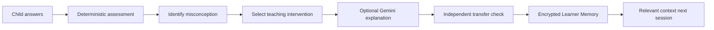
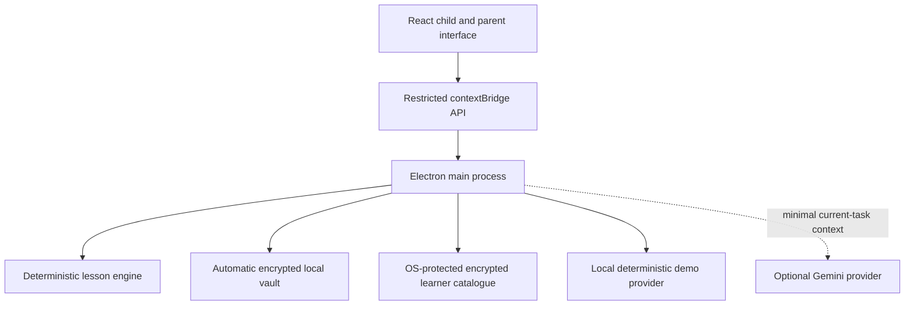

<div align="center">

# MindCarry

### The AI tutor that learns how each child learns

**A local-first tutoring system with encrypted, portable Learner Memory.**

[](https://github.com/inbharatai/mindcarry/actions/workflows/ci.yml)
[](#current-status)
[](#run-mindcarry-locally)
[](#automatic-encrypted-vault)
[](#add-a-gemini-test-key)

</div>

---

## What MindCarry is

MindCarry is a pre-MVP AI tutor being built for children aged 5–10 learning foundational reading, writing and maths.

A useful tutor should not treat every lesson as a new chat. Over time, it should understand what a child has mastered, where the child hesitates, which misconceptions recur and which explanation helped the child understand.

MindCarry is designed around a **Learner Memory** that is:

- stored on the family’s device;
- encrypted with a parent passphrase;
- portable between supported MindCarry installations;
- separate from the AI provider;
- structured around learning evidence rather than unlimited chat history.

> [!IMPORTANT]
> MindCarry is still **pre-MVP**. The repository contains an implementation-ready desktop prototype codebase and automated tests, but the application must still be installed and tested end to end on the target Windows computer with a real Gemini test key, microphone and optional camera. It is not yet a production child-facing product.

## Product thesis



The AI model can change. The child’s accumulated learning context should continue with the family.

## First prototype goal

The first complete prototype must prove one narrow loop:

1. A parent creates a learner profile.
2. MindCarry creates every required local folder automatically.
3. The learner completes a short voice-enabled maths lesson.
4. MindCarry identifies a misconception using deterministic assessment logic.
5. It adapts the explanation and checks a different representation.
6. The learner completes an independent transfer question.
7. The result is written to the encrypted local Learner Memory.
8. The application closes and reopens without losing the learner state.
9. The encrypted Learner Memory is exported as a `.childmind` package.
10. Another supported installation imports it and resumes with the same learner context.

## Current status

| Capability | Repository status | Device validation |
|---|---:|---:|
| Electron + React + TypeScript desktop shell | Implemented | Pending target-device launch |
| Automatic app vault creation | Implemented | Pending target-device confirmation |
| Automatic per-learner folder creation | Implemented | Pending target-device confirmation |
| Parent-passphrase database encryption | Implemented and tested in CI | Pending target-device confirmation |
| Encrypted device learner catalogue | Implemented and tested in CI | Pending OS credential-store confirmation |
| Adaptive addition-within-20 flow | Implemented and tested in CI | Pending child/parent testing |
| Typed answers | Implemented | Pending UI testing |
| Browser/OS speech recognition | Implemented when supported | Pending Windows microphone testing |
| Optional local movement cue | Implemented | Pending camera-permission testing |
| Gemini-generated reteaching explanation | Implemented | Pending real API-key test |
| Gemini Live real-time voice | Not implemented | Planned |
| `.childmind` export/import | Implemented and tested in CI | Pending two-installation test |
| Reading and phonics curriculum | Not implemented | Planned |
| Writing support | Not implemented | Planned |
| Production child-safety review | Not completed | Required before public release |

## Automatic encrypted vault

Parents do **not** create or connect folders manually.

When MindCarry starts, it automatically creates a private application vault using Electron’s operating-system-specific application-data location. The exact location is shown inside **Settings → Automatic local vault**.

```text
MindCarryVault/
├── vault.json                 # Technical descriptor; no learner PII
├── settings.json              # OS-encrypted device key and Gemini-key envelope
├── learner-catalog.enc        # Encrypted local learner list
├── learners/
│   └── <learner-uuid>/
│       ├── manifest.json      # Technical metadata; no child name or age
│       ├── learner.db.enc     # Encrypted SQLite learner database
│       ├── backups/           # Rotating encrypted database backups
│       ├── media/             # Reserved; raw media remains disabled
│       ├── handwriting/       # Reserved for consented future samples
│       ├── pronunciation/     # Reserved for consented future samples
│       └── session-cache/     # Temporary local lesson state
├── exports/                   # Default location for .childmind exports
├── backups/
├── recovery/
└── temp/
```

### What is encrypted

- child profile and parent goal;
- interests;
- lesson attempts and response time;
- misconceptions and interventions;
- mastery evidence;
- session summaries;
- structured learner memories;
- the local learner catalogue containing learner names.

### What remains outside the learner database

Only non-personal technical metadata required to recognise the encrypted file format, schema version, learner UUID, timestamps and integrity hash.

### Encryption design

- AES-256-GCM authenticated encryption;
- parent key derived with scrypt and a random salt;
- random IV for every database save;
- learner UUID bound as authenticated associated data;
- atomic file replacement to reduce corruption risk;
- rotating encrypted backups;
- database integrity verification after decryption;
- separate OS-protected device key for the encrypted learner catalogue.

The parent passphrase is not written to disk. MindCarry cannot recover a forgotten passphrase in the current prototype.

## Privacy and AI-provider boundary

MindCarry is local-first, not fully offline when Gemini is enabled.

### Stays local

- permanent learner profile;
- mastery and progress records;
- lesson attempts;
- structured misconceptions;
- session summaries;
- encrypted backups;
- `.childmind` package;
- camera frame processing in the current experiment.

### Sent to Gemini when enabled

Only a small current-task context needed to generate a short alternative explanation, such as:

- current question;
- age;
- one relevant interest;
- observed misconception;
- a previously useful teaching strategy.

The complete learner database is never sent to Gemini by this implementation.

### API-key storage

The Gemini key is:

- entered only inside MindCarry Settings;
- tested before Gemini mode is enabled;
- encrypted using Electron `safeStorage`;
- kept outside learner folders;
- excluded from `.childmind` exports;
- never intended for source code or `.env` files.

## Multimodal personalisation boundary

The long-term vision includes voice, pronunciation, spoken reasoning, response time, posture and observable engagement cues—with explicit parental permission.

The current camera experiment is deliberately narrow. It calculates frame-to-frame movement intensity locally and does **not**:

- recognise a face;
- identify a child;
- infer ethnicity, gender or personality;
- diagnose emotion, attention, ADHD, autism or any condition;
- upload webcam frames;
- save raw video.

Behavioural cues are teaching signals, not medical or psychological conclusions.

## Architecture



### Technology

- Electron
- React
- TypeScript
- Vite
- SQL.js / SQLite
- Node.js cryptography
- Google Gen AI JavaScript SDK
- Zod
- Zustand
- Vitest
- electron-builder
- GitHub Actions on Windows and Linux

## Run MindCarry locally

### Requirements

- Windows 10/11, macOS or a supported Linux desktop
- Node.js 22.12 or newer
- Git
- internet connection only for dependency installation and optional Gemini use

### Windows: automated Desktop installation

The installer script creates or updates:

```text
C:\Users\<Windows-user>\Desktop\MindCarry
```

Run from PowerShell:

```powershell
Set-ExecutionPolicy -Scope Process Bypass
irm https://raw.githubusercontent.com/inbharatai/mindcarry/main/INSTALL_TO_DESKTOP.ps1 | iex
```

The script:

1. locates the Windows Desktop automatically;
2. installs Git and Node.js LTS through `winget` when missing;
3. creates the `MindCarry` Desktop folder by cloning the repository;
4. installs pinned dependencies;
5. runs linting, encryption tests, integration tests and a production build;
6. starts MindCarry only after verification passes.

For a security-conscious installation, download and inspect `INSTALL_TO_DESKTOP.ps1` before running it rather than piping it directly to PowerShell.

### Existing clone

```powershell
cd C:\Users\reetu\Desktop\MindCarry
powershell -ExecutionPolicy Bypass -File .\setup-windows.ps1
```

### Manual cross-platform setup

```bash
git clone https://github.com/inbharatai/mindcarry.git
cd mindcarry
npm install --no-audit --no-fund
npm run check
npm run dev
```

MindCarry starts in deterministic **demo mode** without an API key.

## Add a Gemini test key

After the application opens:

1. Open **Settings**.
2. Confirm the automatic local vault shows **Vault ready**.
3. Paste the Gemini test API key.
4. Select **Save securely and test Gemini**.
5. Confirm the connection test succeeds.
6. Return to the learner profile and run the lesson.

Do not paste the API key into GitHub, source code, a chat message or a `.env` file.

The current provider is configured for `gemini-2.5-flash` to generate short reteaching explanations. Gemini Live voice is a separate future phase.

## Test scenario

Use the first controlled scenario:

- learner: Aarav;
- age: 7;
- interest: dinosaurs;
- goal: build confidence in foundational maths;
- camera: initially off;
- raw audio/video storage: off.

Then:

1. Start the addition lesson.
2. Answer `11` to `7 + 5`.
3. Explain that the objects were counted incorrectly.
4. Confirm MindCarry records an off-by-one misconception.
5. Complete the second question independently.
6. Complete the transfer question independently.
7. Review the session summary, mastery and evidence-based memories.
8. Lock and reopen the learner.
9. Close and restart MindCarry.
10. Export the `.childmind` package.
11. Import it into another installation.
12. Enter the same parent passphrase and confirm the learner state is restored.

## Development commands

| Command | Purpose |
|---|---|
| `npm run dev` | Start Vite and Electron |
| `npm run lint` | Lint security-sensitive Node/Electron code |
| `npm run test:core` | Run dependency-free encryption and lesson smoke tests |
| `npm test` | Run unit and integration tests |
| `npm run build` | Type-check and build the renderer |
| `npm run check` | Run the complete local verification pipeline |
| `npm run pack` | Verify and create an unpacked application build |
| `npm run dist` | Verify and create platform packages |

## What automated tests cover

- encryption/decryption round trip;
- wrong-passphrase rejection;
- associated-data mismatch;
- encrypted-data tampering;
- device-key catalogue encryption;
- automatic vault and learner-folder creation;
- atomic writes;
- spoken-number parsing;
- misconception classification;
- interest-based intervention selection;
- independent-transfer mastery requirement;
- encrypted learner persistence across restarts;
- plaintext-manifest PII exclusion;
- `.childmind` export/import between two installations.

Automated tests do not replace real child, parent, accessibility, microphone, camera or model-behaviour testing.

## Security posture

The desktop window uses:

- `nodeIntegration: false`;
- `contextIsolation: true`;
- renderer sandboxing;
- a restricted preload bridge;
- sender validation for IPC requests;
- blocked arbitrary navigation and new windows;
- explicit media-permission handlers;
- a restrictive Content Security Policy;
- no arbitrary renderer filesystem access.

Before a public release, MindCarry still requires:

- independent security review;
- child-safety and safeguarding review;
- privacy-law review for launch jurisdictions;
- dependency and software-composition monitoring;
- signed releases and update security;
- threat testing on Windows and macOS;
- parent memory inspection, correction and deletion controls;
- broader curriculum and assessment validation.

## Current limitations

- The product is pre-MVP and has not completed a target-device end-to-end run.
- The curriculum is limited to a small addition-within-20 prototype.
- Browser/OS speech recognition is not equivalent to Gemini Live voice.
- The camera experiment measures only movement intensity.
- The current database is SQL.js persisted as encrypted bytes, not SQLCipher.
- The Gemini provider generates short reteaching explanations rather than controlling the complete lesson state machine.
- Parent memory editing, selective deletion and passphrase change are not yet implemented.
- No production analytics, cloud account system or Vercel deployment is configured.
- No claim is made that this prototype complies with every child-data law before legal review.

## Documentation

- [`ABOUT.md`](ABOUT.md) — product purpose and principles
- [`PROJECT_STATUS.md`](PROJECT_STATUS.md) — verified implementation status
- [`docs/architecture.md`](docs/architecture.md) — system design and trust boundaries
- [`docs/local-vault.md`](docs/local-vault.md) — automatic folder and encryption model
- [`docs/privacy-model.md`](docs/privacy-model.md) — local/provider data boundary
- [`docs/threat-model.md`](docs/threat-model.md) — risks and mitigations
- [`docs/security-audit.md`](docs/security-audit.md) — audit findings and release gates
- [`docs/demo-script.md`](docs/demo-script.md) — first end-to-end test
- [`docs/roadmap.md`](docs/roadmap.md) — staged development plan
- [`SECURITY.md`](SECURITY.md) — vulnerability reporting

## Deployment note

MindCarry is currently a local Electron application. Vercel is intentionally not configured. A future public website or waitlist may be hosted separately, but the local learner-memory architecture must not be replaced accidentally by a cloud database.

---

<div align="center">

### MindCarry should not only remember what a child learned.
### It should gradually learn how that specific child learns best.

</div>
