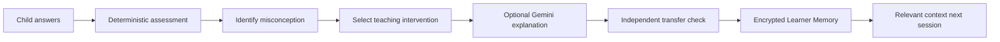
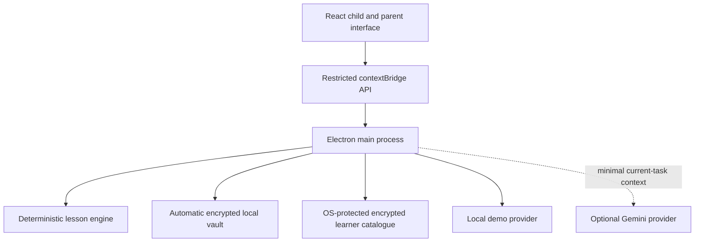

<div align="center">

# MindCarry

### The AI tutor that learns how each child learns

**A local-first tutoring system with encrypted, portable Learner Memory.**

[](https://github.com/inbharatai/mindcarry/actions/workflows/ci.yml)
[](https://github.com/inbharatai/mindcarry/actions/workflows/codeql.yml)
[](#current-status)
[](#run-mindcarry-locally)
[](#automatic-encrypted-vault)
[](#add-a-gemini-test-key)

</div>

---

## What MindCarry is

MindCarry is a pre-MVP AI tutor being built for children aged 5–10 learning foundational reading, writing and maths.

A useful tutor should not treat every lesson as a new chat. Over time, it should understand what a child has mastered, where the child hesitates, which misconceptions recur and which explanations helped the child understand.

MindCarry is designed around a **Learner Memory** that is:

- stored on the family’s device;
- encrypted with a parent passphrase;
- portable between supported MindCarry installations;
- separate from the AI provider;
- structured around learning evidence rather than unlimited chat history.

> [!IMPORTANT]
> MindCarry is still **pre-MVP**. This repository contains an implementation-ready desktop prototype and automated verification, but the application must still be installed and tested end to end on the founder’s Windows computer with a real Gemini test key, microphone and optional camera. It is not yet a production child-facing product.

## Product thesis



The AI model can change. The child’s accumulated learning context should remain with the family.

## First prototype goal

The first complete prototype must prove one narrow loop:

1. A parent creates a learner profile.
2. MindCarry creates every required local folder automatically.
3. The learner completes a short voice-enabled maths lesson.
4. MindCarry identifies a misconception using deterministic assessment logic.
5. It changes the teaching representation and checks again.
6. The learner completes an independent transfer question.
7. The result is written to the encrypted local Learner Memory.
8. The application closes and reopens without losing the learner state.
9. The encrypted Learner Memory is exported as a `.childmind` package.
10. Another supported installation imports it and resumes with the same learner context.

## Current status

| Capability | Repository status | Target-device validation |
|---|---:|---:|
| Electron + React + TypeScript desktop shell | Implemented | Pending launch |
| Automatic app vault creation | Implemented and tested | Pending path confirmation |
| Automatic per-learner folders | Implemented and tested | Pending path confirmation |
| Parent-passphrase encryption | Implemented and tested | Pending local inspection |
| Encrypted learner catalogue | Implemented and tested | Pending OS-store confirmation |
| Addition-within-20 lesson | Implemented and tested | Pending supervised use |
| Typed answers | Implemented | Pending UI test |
| Browser/OS speech recognition | Implemented when supported | Pending microphone test |
| Optional local movement cue | Implemented | Pending camera test |
| Gemini reteaching explanation | Implemented | Pending real key test |
| Gemini Live voice | Not implemented | Planned |
| `.childmind` export/import | Implemented and tested | Pending two-installation test |
| Reading and phonics curriculum | Not implemented | Planned |
| Writing support | Not implemented | Planned |
| Production child-safety review | Not completed | Required before release |

## Automatic encrypted vault

Parents do **not** create, name or connect folders manually.

On first launch, MindCarry automatically creates a private application vault using Electron’s operating-system-specific application-data location. The exact path is shown inside **Settings → Automatic local vault**.

```text
MindCarryVault/
├── vault.json                 # Technical descriptor; no learner PII
├── settings.json              # OS-encrypted device/Gemini key envelopes
├── learner-catalog.enc        # Encrypted local learner list
├── learners/
│   └── <learner-uuid>/
│       ├── manifest.json      # Technical metadata; no child name or age
│       ├── learner.db.enc     # Encrypted SQLite learner database
│       ├── backups/           # Rotating encrypted database backups
│       ├── media/             # Reserved; raw media remains disabled
│       ├── handwriting/       # Reserved for future consented samples
│       ├── pronunciation/     # Reserved for future consented samples
│       └── session-cache/     # Temporary lesson state
├── exports/                   # Default `.childmind` export location
├── backups/
├── recovery/
└── temp/
```

### Encryption design

- AES-256-GCM authenticated encryption;
- 256-bit key derived from the parent passphrase with scrypt;
- random salt and IV;
- learner UUID bound as authenticated associated data;
- atomic encrypted-file replacement;
- rotating encrypted backups;
- SQLite integrity verification after decryption;
- separate OS-protected key for the encrypted learner catalogue.

The parent passphrase is not written to disk. The current prototype cannot recover a forgotten passphrase.

## Privacy and AI-provider boundary

MindCarry is local-first, not fully offline when Gemini is enabled.

### Stays local

- learner profile and parent goal;
- mastery and progress records;
- attempts and misconceptions;
- session summaries;
- structured learner memories;
- encrypted backups and exports;
- camera frame processing in the current experiment.

### Sent to Gemini when enabled

Only limited context required for one short reteaching explanation:

- current question;
- learner age;
- one relevant interest;
- observed misconception;
- one teaching strategy.

The complete learner database, passphrase, raw camera frames and `.childmind` package are not sent by this implementation.

### API-key storage

The Gemini key is:

- entered only inside MindCarry Settings;
- tested before Gemini mode is enabled;
- encrypted using Electron `safeStorage`;
- kept outside learner folders;
- excluded from `.childmind` exports;
- never intended for source code or `.env` files.

## Multimodal personalisation boundary

The long-term vision includes voice, pronunciation, spoken reasoning, response time, posture and observable engagement cues—with explicit parental permission.

The current camera experiment is deliberately narrow. It calculates frame-to-frame movement intensity locally and does **not**:

- recognise or identify a face;
- infer demographic traits or personality;
- diagnose emotion, attention, ADHD, autism or any condition;
- upload camera frames;
- save raw video.

Behavioural cues are teaching signals, not medical or psychological conclusions.

## Architecture



### Technology

- Electron
- React
- TypeScript
- Vite
- SQL.js / SQLite
- Node.js cryptography
- Google Gen AI JavaScript SDK
- Vitest
- electron-builder
- GitHub Actions on Windows and Linux
- CodeQL security analysis

## Run MindCarry locally

### Requirements

- Windows 10/11, macOS or a supported Linux desktop
- Node.js 22.12 or newer
- Git
- internet connection for dependency installation and optional Gemini use

### Windows: automated Desktop installation

The installer creates or updates:

```text
C:\Users\<Windows-user>\Desktop\MindCarry
```

For the safest route, download and inspect [`INSTALL_TO_DESKTOP.ps1`](INSTALL_TO_DESKTOP.ps1), then run it from PowerShell.

```powershell
Set-ExecutionPolicy -Scope Process Bypass
.\INSTALL_TO_DESKTOP.ps1
```

The script:

1. locates the Windows Desktop automatically;
2. installs Git and Node.js LTS through `winget` when missing;
3. creates the Desktop source folder by cloning the repository;
4. installs pinned direct dependencies;
5. runs linting, encryption tests, integration tests and a production build;
6. starts MindCarry only after verification passes.

### Existing clone

```powershell
cd C:\Users\reetu\Desktop\MindCarry
powershell -ExecutionPolicy Bypass -File .\setup-windows.ps1
```

### Manual cross-platform setup

```bash
git clone https://github.com/inbharatai/mindcarry.git
cd mindcarry
npm install --no-audit --no-fund
npm run check
npm run dev
```

MindCarry starts in deterministic **demo mode** without an API key.

## Add a Gemini test key

After the application opens:

1. Open **Settings**.
2. Confirm the automatic local vault shows **Vault ready**.
3. Paste the Gemini test API key.
4. Select **Save securely and test Gemini**.
5. Confirm the connection test succeeds.
6. Return to the learner profile and run the lesson.

Do not paste the API key into GitHub, source code, a chat message or a `.env` file.

The current provider uses `gemini-2.5-flash` for short reteaching explanations. Gemini Live voice is a separate future phase.

## Acceptance-test scenario

Use a synthetic learner:

- name: Aarav;
- age: 7;
- interest: dinosaurs;
- goal: build confidence in foundational maths;
- camera: initially off;
- raw audio/video storage: off.

Then:

1. answer `11` to `7 + 5`;
2. confirm an off-by-one misconception is recorded;
3. complete the second question independently;
4. complete the transfer question independently;
5. review mastery and structured memories;
6. lock, close and reopen MindCarry;
7. confirm the history remains;
8. test Gemini success and deterministic fallback;
9. export the `.childmind` package;
10. import and unlock it in a clean second installation.

See [`docs/demo-script.md`](docs/demo-script.md) for the full pass/fail procedure.

## Development commands

| Command | Purpose |
|---|---|
| `npm run dev` | Start Vite and Electron |
| `npm run lint` | Lint security-sensitive Node/Electron code |
| `npm run test:core` | Run dependency-free encryption and lesson smoke tests |
| `npm test` | Run unit and integration tests |
| `npm run build` | Type-check and build the renderer |
| `npm run check` | Run the complete local verification pipeline |
| `npm run pack` | Verify and create an unpacked application build |
| `npm run dist` | Verify and create platform packages |

## Automated verification covers

- encryption/decryption;
- wrong-passphrase and associated-data rejection;
- ciphertext tampering;
- encrypted device catalogue;
- automatic vault and learner-folder creation;
- atomic writes;
- spoken-number parsing;
- misconception and intervention logic;
- transfer-based mastery;
- encrypted close/reopen persistence;
- PII exclusion from plaintext manifests;
- `.childmind` export/import across two simulated installations;
- TypeScript production build;
- Windows and Linux execution of the verification pipeline;
- CodeQL JavaScript/TypeScript analysis.

Automated tests do not replace real child, parent, accessibility, microphone, camera or model-behaviour testing.

## Security posture

The desktop window uses:

- `nodeIntegration: false`;
- `contextIsolation: true`;
- renderer sandboxing;
- a restricted preload bridge;
- sender validation for IPC requests;
- blocked arbitrary navigation and new windows;
- explicit media-permission handlers;
- a restrictive Content Security Policy;
- no arbitrary renderer filesystem access.

Before public use, MindCarry still requires independent security, safeguarding, privacy/legal, curriculum, accessibility and model-behaviour review, as well as signed releases and secure updates.

## Current limitations

- The product remains pre-MVP until target-device acceptance testing passes.
- The curriculum is limited to addition within 20.
- Browser/OS speech recognition is not Gemini Live voice.
- The camera experiment measures only movement intensity.
- The database uses SQL.js persisted as encrypted bytes, not SQLCipher.
- Gemini generates short reteaching wording rather than controlling the lesson state machine.
- Parent memory correction, deletion and passphrase change are not implemented.
- A dependency lockfile and release-signing pipeline are still required.
- No Vercel deployment is configured.
- No claim is made that this prototype satisfies every child-data law before legal review.

## Documentation

- [`ABOUT.md`](ABOUT.md) — purpose and honest product stage
- [`PROJECT_STATUS.md`](PROJECT_STATUS.md) — implementation and validation gates
- [`docs/architecture.md`](docs/architecture.md) — design and trust boundaries
- [`docs/local-vault.md`](docs/local-vault.md) — automatic folders and encryption
- [`docs/privacy-model.md`](docs/privacy-model.md) — local/provider data boundary
- [`docs/threat-model.md`](docs/threat-model.md) — risks and controls
- [`docs/security-audit.md`](docs/security-audit.md) — audit findings and release gates
- [`docs/demo-script.md`](docs/demo-script.md) — end-to-end acceptance test
- [`docs/roadmap.md`](docs/roadmap.md) — evidence-based roadmap
- [`SECURITY.md`](SECURITY.md) — vulnerability reporting

## Deployment note

MindCarry is currently a local Electron application. Vercel is intentionally not configured. A future public website or waitlist may be hosted separately, but the local learner-memory architecture must not be replaced accidentally by a cloud database.

---

<div align="center">

### MindCarry should not only remember what a child learned.
### It should gradually learn how that specific child learns best.

</div>
