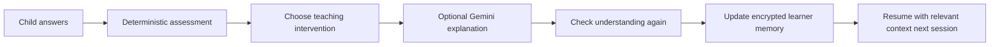
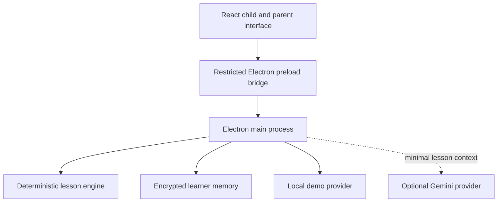

<div align="center">

# MindCarry

### The AI tutor that learns how each child learns.

**A local-first, voice-enabled AI tutor alpha with encrypted, portable learner memory.**

[](#current-status)
[](#run-locally)
[](#privacy-and-data-boundaries)
[](#optional-gemini-setup)

</div>

---

## What MindCarry is

MindCarry is an experimental desktop AI tutor for children. Its core idea is simple: a useful tutor should not treat every lesson as a fresh conversation. It should gradually remember what a child understands, where they struggle, which explanations help, and what should happen next.

MindCarry keeps that learner history in an encrypted local memory controlled by the family. The AI provider is replaceable; the learner memory is designed to remain portable across supported MindCarry installations.

> [!IMPORTANT]
> MindCarry is currently an **alpha prototype**, not a finished child-facing product. The present build demonstrates a narrow adaptive maths lesson and the local-memory loop. It is not yet a complete reading, writing and maths curriculum.

## The product thesis

Most AI tutors are built around a chat session. MindCarry is built around a persistent learner model.



The long-term direction is a tutor that can adapt to a child’s:

- mastered skills and unfinished concepts;
- recurring misconceptions;
- response time and use of hints;
- spoken reasoning and pronunciation;
- interests and preferred examples;
- successful teaching strategies;
- observable engagement cues, with parental permission and local processing.

The current alpha implements only a small, testable part of that vision.

## Current status

| Area | Alpha status |
|---|---|
| Learner profiles | Implemented |
| Parent passphrase | Implemented |
| Encrypted local learner database | Implemented |
| Adaptive addition lesson | Implemented |
| Typed answers | Implemented |
| Browser/OS speech recognition | Implemented when supported by the device |
| Misconception detection | Implemented for the current maths flow |
| Mastery calculation | Implemented for the current maths flow |
| Session summaries and persistent memories | Implemented |
| `.childmind` export and import | Implemented |
| Local camera movement cue | Optional experimental feature |
| Gemini-generated explanations | Optional with a user-provided API key |
| Gemini Live real-time voice | Not yet implemented |
| Reading and phonics curriculum | Planned |
| Writing support | Planned |
| Mobile/tablet application | Planned |

## What this alpha proves

The current build demonstrates an end-to-end vertical slice:

1. A parent creates a separate learner profile and passphrase.
2. The child completes a short addition lesson using typed or supported speech input.
3. MindCarry evaluates the answer with deterministic logic.
4. It records attempts, misconceptions, interventions and mastery evidence.
5. The session is written to the encrypted local learner database.
6. The application can be closed and reopened without losing the learner state.
7. The learner can be exported as an encrypted `.childmind` file.
8. Another MindCarry installation can import the learner package and continue from the same memory.

## Personalisation in the alpha

MindCarry currently personalises lessons using:

- the learner’s preferred name;
- age and language profile;
- parent-defined goal;
- interests, such as dinosaurs or space;
- correctness and independence;
- response time;
- hint usage;
- detected misconception;
- previous session memories.

An optional camera experiment measures **frame-to-frame movement intensity locally**. It does not identify the child, recognise faces, upload frames, infer emotions, or diagnose attention or developmental conditions.

## Architecture



### Technology

- **Desktop shell:** Electron
- **Interface:** React + TypeScript + Vite
- **Local data:** SQL.js / SQLite persisted as encrypted bytes
- **Encryption:** AES-256-GCM with a scrypt-derived key
- **AI integration:** Google GenAI SDK with Gemini 3.6 Flash as the configured optional provider
- **State:** Zustand
- **Validation:** Zod
- **Testing:** Vitest plus a dependency-free core smoke test
- **Packaging:** electron-builder

## Privacy and data boundaries

MindCarry is local-first, but it is not fully offline when Gemini is enabled.

### Stays on the family’s device

- learner profile;
- progress and mastery records;
- attempts and misconceptions;
- session summaries;
- structured learner memories;
- encrypted `.childmind` package;
- camera movement calculations in the alpha.

### Sent to Gemini only when enabled

- a limited amount of current lesson context required to generate a short explanation.

### Never included in learner exports

- Gemini API keys;
- operating-system credentials;
- unencrypted learner database content.

The Gemini key is stored separately using Electron `safeStorage`. Raw camera video and raw audio are not stored by the current alpha.

## Run locally

### Requirements

- Windows, macOS or Linux desktop environment
- Node.js **22.12 or newer**
- Git

### Clone and start

```bash
git clone https://github.com/inbharatai/mindcarry.git
cd mindcarry
npm install
npm run test:core
npm run dev
```

MindCarry opens in **demo mode** without an API key. This is the safest way to test the learner-memory and lesson flow first.

### Windows Desktop path

```powershell
cd C:\Users\reetu\Desktop
git clone https://github.com/inbharatai/mindcarry.git MindCarry
cd MindCarry
npm install
npm run test:core
npm run dev
```

## Optional Gemini setup

1. Start MindCarry.
2. Open **Settings**.
3. Add a Gemini test API key.
4. Use **Test connection**.
5. Return to the learner lesson.

Do not commit API keys to GitHub, place them in source files, or store them inside a `.childmind` package.

The current Gemini integration generates short alternative explanations after an incorrect answer. Speech recognition is still handled by the browser/operating-system capability when available; Gemini Live voice is a later phase.

## Useful commands

| Command | Purpose |
|---|---|
| `npm run dev` | Start the Vite renderer and Electron app |
| `npm run test:core` | Run the dependency-free encryption and lesson-engine smoke test |
| `npm test` | Run the Vitest suite |
| `npm run build` | Type-check and build the renderer |
| `npm run check` | Run the core test and production build |
| `npm run pack` | Create an unpacked desktop build |
| `npm run dist` | Build platform packages with electron-builder |

## Demo walkthrough

Use the included test scenario:

1. Create **Aarav**, age 7, with `dinosaurs` as an interest.
2. Start the addition lesson.
3. Give an incorrect answer to the first question.
4. Observe the misconception and personalised explanation.
5. Complete the next questions correctly.
6. Review the mastery result and saved memory.
7. Close and reopen MindCarry.
8. Unlock Aarav’s profile and confirm the history remains.
9. Export `Aarav.childmind`.
10. Import the file into another supported MindCarry installation.

See [`docs/demo-script.md`](docs/demo-script.md) for the exact sequence.

## Learner-memory portability

A `.childmind` file contains:

- the already-encrypted learner database;
- the learner manifest;
- format and schema version information;
- an integrity checksum.

It does **not** contain the Gemini API key. The original parent passphrase is required to unlock the learner after import.

## Safety principles

MindCarry is being designed for children, so the standard is higher than a general chatbot.

The alpha deliberately avoids:

- face recognition;
- identity matching;
- emotion diagnosis;
- behavioural or medical diagnosis;
- permanent raw webcam storage;
- unrestricted open-ended chat;
- hidden cloud memory presented as local memory.

Before any public child-facing release, the product requires broader curriculum testing, independent privacy and security review, parent controls, child-safety evaluation and real-world testing with families.

## Current limitations

- The current curriculum is limited to a small addition-within-20 demonstration.
- Gemini is used only for optional generated explanations, not full agentic lesson orchestration.
- Gemini Live voice is not implemented.
- Speech recognition depends on Chromium/operating-system support.
- The camera experiment measures movement intensity only.
- The encrypted database uses SQL.js persisted as encrypted bytes, not SQLCipher.
- Parent memory review, editing and selective deletion are not complete.
- The application has not yet undergone independent security, privacy or child-safety review.
- The repository does not yet include a Vercel deployment because the local desktop application is the current product under test.

## Roadmap

### Alpha hardening

- test the complete Windows setup and packaging flow;
- validate Gemini connection and failure handling;
- improve lesson-state recovery;
- expand automated tests;
- improve parent-visible memory controls.

### Private beta

- Gemini Live voice;
- reading and phonics curriculum;
- stronger mastery and spaced-review model;
- personal engagement baseline rather than universal assumptions;
- parent memory review, correction and deletion;
- tablet-friendly experience.

### Later

- writing analysis with explicit parental consent;
- additional languages;
- local-model provider;
- Android application using the same learner-memory specification;
- broader reading, writing and maths curriculum.

## Documentation

- [`ABOUT.md`](ABOUT.md) — product purpose, principles and long-term direction
- [`docs/architecture.md`](docs/architecture.md) — system boundaries and data flow
- [`docs/privacy-model.md`](docs/privacy-model.md) — local and provider data boundaries
- [`docs/threat-model.md`](docs/threat-model.md) — security risks and mitigations
- [`docs/demo-script.md`](docs/demo-script.md) — executable alpha demo
- [`ROADMAP.md`](ROADMAP.md) — development stages
- [`PROJECT_STATUS.md`](PROJECT_STATUS.md) — implementation and verification status

## Deployment note

MindCarry is currently a local Electron application. Vercel is intentionally not configured yet. It may later host a public website, waitlist or a carefully separated web companion, but it should not replace the local learner-memory architecture without an explicit privacy redesign.

---

<div align="center">

### MindCarry does not only remember what a child learned.
### It is being built to learn how that specific child learns best.

</div>
