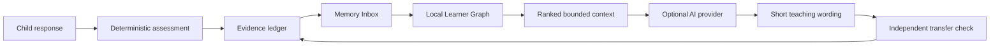
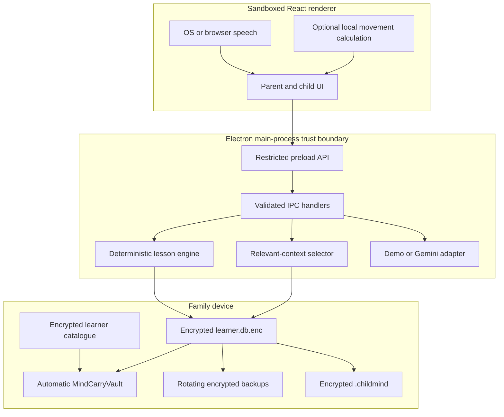

<div align="center">

# MindCarry

### The AI tutor that learns how each child learns

**A local-first, desktop pre-MVP with encrypted, portable and family-controlled Learner Memory.**

[](https://github.com/inbharatai/mindcarry/actions/workflows/ci.yml)
[](https://github.com/inbharatai/mindcarry/actions/workflows/codeql.yml)
[](#honest-current-status)
[](#learner-memory)
[](#repository-workflow)

[Start](#run-it-on-windows) · [API key](#connect-a-gemini-test-key) · [Architecture](#architecture) · [Privacy](#privacy-boundary) · [Testing](#verification) · [Status](#honest-current-status)

</div>

---

> [!IMPORTANT]
> MindCarry is **pre-MVP**. The repository contains an implemented and automatically tested desktop vertical slice. It is not yet a production child-learning product, and repository tests do not replace founder-device, parent, child-safety, curriculum, security or legal validation.

## What MindCarry does

MindCarry currently demonstrates one complete learner-memory loop for **addition within 20**:

1. A parent creates a protected learner profile.
2. The child completes three distinct maths questions.
3. MindCarry assesses answers deterministically.
4. It records independent work, hints, response time, misconceptions and transfer evidence.
5. It updates a parent-visible **Memory Inbox**.
6. It rebuilds a local, explained **Learner Graph**.
7. It selects a small, relevant context packet for the next lesson.
8. The family can export the complete encrypted learner record as one `.childmind` file.

Gemini is optional. It may rephrase a short teaching explanation, but it does not decide correctness, mastery, lesson completion or permanent memory writes.

## Core principles

| Principle | Implemented boundary |
|---|---|
| **Family-controlled** | The canonical learner record lives in the family’s local encrypted vault. |
| **Portable** | Profile, evidence, Memory Inbox and graph move together in one encrypted `.childmind` package. |
| **Model-independent** | The same bounded context can support Gemini, another API or a future local model. |
| **Evidence-led** | Permanent memory is created from structured application evidence, not unrestricted model prose. |
| **Parent-visible** | Parents can inspect, archive and restore memory items. |
| **Fail-safe** | Demo teaching continues when Gemini is absent, unavailable or rate-limited. |

## Product loop



## Learner Memory

### Evidence ledger

The encrypted learner database stores structured records such as:

- questions and answers;
- correct/incorrect result;
- independent or hint-assisted response;
- bounded response time;
- misconception classification;
- teaching intervention;
- reasoning observation;
- mastery and review state;
- session outcome and recommendation.

### Memory Inbox

Each parent-visible memory item contains:

- type and content;
- confidence;
- evidence count;
- source lesson;
- creation and confirmation dates;
- active or archived state;
- graph-connection count.

Archiving removes an item from future lesson context without erasing the audit history. Repeated evidence does not silently reactivate a parent-archived memory. The parent can restore it explicitly.

### Local Learner Graph

The graph is embedded inside the encrypted SQLite database. It uses deterministic identifiers and explicit provenance.

Current node kinds:

```text
learner · skill · interest · memory · session
```

Current relations:

```text
LEARNING_SKILL
INTERESTED_IN
SHOWED_SKILL_EVIDENCE
SHOWED_MISCONCEPTION
RESPONDED_TO_STRATEGY
HAS_LEARNING_PREFERENCE
HAS_OBSERVATION
ABOUT_SKILL
OBSERVED_DURING
```

Each edge stores confidence, evidence count, source memory/session and one provenance value:

- `EXTRACTED` — directly represented in canonical records;
- `DERIVED` — produced by deterministic MindCarry rules;
- `PARENT` — reserved for a future parent-confirmed relationship.

MindCarry does **not** require Graphify, Neo4j, a cloud graph database or a vector database for its canonical learner memory.

### Relevant context selection

Before a lesson, MindCarry ranks active memories using:

- objective and skill overlap;
- memory type;
- evidence count;
- confidence;
- recency;
- due-for-review status.

The current context limits are:

```text
maximum active memories: 8
maximum graph facts: 12
maximum provider-context text: 1,800 characters
```

A parent-visible context preview may contain the learner’s name. The separate provider-safe context replaces learner-node identity with the word `Learner` and excludes the complete database, graph export, passphrase and API key.

## Architecture



### Electron protections

- renderer Node integration disabled;
- context isolation and sandbox enabled;
- production DevTools disabled;
- arbitrary navigation and new windows denied;
- exact renderer origin/file validation for IPC;
- renderer CSP blocks external network connections;
- narrow named preload methods only;
- media denied by default and enabled only for an active consented lesson;
- Linux `basic_text` credential fallback rejected as insecure.

## Automatic encrypted vault

Parents do not create or connect technical folders.

On first launch MindCarry creates:

```text
<electron-user-data>/MindCarryVault/
├── vault.json
├── settings.json
├── learner-catalog.enc
├── learners/
│   └── <learner-uuid>/
│       ├── manifest.json
│       ├── learner.db.enc
│       ├── backups/
│       ├── media/
│       ├── handwriting/
│       ├── pronunciation/
│       └── session-cache/
├── exports/
├── backups/
├── recovery/
└── temp/
```

`manifest.json` contains technical metadata only. Child name, age, interests, goal, sessions, memories and graph remain inside `learner.db.enc`.

### Encryption

- AES-256-GCM authenticated encryption;
- scrypt-derived 256-bit learner key;
- random salt and IV;
- learner UUID bound as authenticated associated data;
- strict versioned-envelope and canonical-base64 validation;
- atomic encrypted-file replacement;
- five rotating encrypted database backups;
- SQLite integrity, identity and consent-record verification after unlock;
- parent passphrase never written by MindCarry.

> [!CAUTION]
> The current pre-MVP has no passphrase recovery or vendor backdoor. A forgotten passphrase makes the learner database inaccessible.

## Portable `.childmind` package

The package contains the already-encrypted learner database plus a non-personal technical manifest and checksum. It carries:

- profile and consent;
- skills and mastery;
- sessions and attempts;
- Memory Inbox and lifecycle events;
- learner-graph nodes and edges.

It excludes:

- Gemini API key;
- device catalogue key;
- operating-system credentials;
- plaintext child name and age in the external technical manifest.

Import validates file size, package/schema versions, UUID, canonical base64 and SHA-256 checksum before writing. The receiving installation shows **Imported learner** until the original passphrase verifies the encrypted profile.

## Privacy boundary

### Always local in the current implementation

- complete learner profile and parent goal;
- complete session and attempt history;
- Memory Inbox and archive state;
- learner graph and audit events;
- parent passphrase;
- encrypted backups and exports;
- raw camera frames used by the optional movement experiment.

### May be sent when Gemini is enabled

Only a bounded provider-safe task packet containing:

- current question;
- learner age;
- one relevant interest;
- current misconception;
- one teaching strategy;
- ranked active memory and graph context.

The child’s name, raw audio, raw video, complete learner database, complete graph, passphrase, API key and `.childmind` file are not included in the Gemini prompt.

## Run it on Windows

### Requirements

- Windows 10 or 11;
- Node.js **22.12 or newer**;
- Git;
- internet access for first dependency installation and optional Gemini calls.

### Automated Desktop installation

Run in PowerShell:

```powershell
$installer = "$env:TEMP\MindCarry-Install.ps1"
Invoke-WebRequest `
  "https://raw.githubusercontent.com/inbharatai/mindcarry/main/INSTALL_TO_DESKTOP.ps1" `
  -OutFile $installer
powershell -NoProfile -ExecutionPolicy Bypass -File $installer
```

The installer:

1. installs missing Git/Node LTS through `winget`;
2. clones only `main` into `Desktop\MindCarry`;
3. refuses to overwrite a different repository or local changes;
4. installs the exact `package-lock.json` dependency tree with `npm ci`;
5. runs lint, smoke, tests and production build;
6. starts MindCarry only after verification succeeds.

Logs:

```text
Desktop\MindCarry_Install.log
Desktop\MindCarry\MindCarry_Local_Setup.log
```

### Existing clone

```powershell
cd "$env:USERPROFILE\Desktop\MindCarry"
git fetch --prune origin
git checkout main
git pull --ff-only origin main
powershell -NoProfile -ExecutionPolicy Bypass -File .\setup-windows.ps1
```

### Manual development

```bash
git clone --branch main --single-branch https://github.com/inbharatai/mindcarry.git
cd mindcarry
npm ci --no-audit --no-fund
npm run check
npm run dev
```

Demo mode works without an API key.

## Connect a Gemini test key

1. Launch MindCarry.
2. Open **Settings**.
3. Confirm **Vault ready** and a secure backend such as `dpapi` on Windows.
4. Paste the test key only into the masked **API key** field.
5. Select **Save securely and test Gemini**.
6. Complete a lesson using synthetic learner data.
7. Inspect the Memory Inbox and AI Context Preview.
8. Test fallback by removing the key or disconnecting the network.

The key is tested before provider activation and stored through Electron `safeStorage`. It is outside learner folders and exports.

> [!WARNING]
> Never put an API key in GitHub, source code, `.env`, logs, screenshots, chat or a `.childmind` package.

MindCarry currently defaults to `gemini-2.5-flash`. The provider disables model thinking for these short tutoring responses to reduce latency and keeps a deterministic fallback.

## Verification

### Local command

```bash
npm run check
```

This runs:

- ESLint over privileged Electron and automation code;
- dependency-free security smoke checks;
- unit/integration tests;
- TypeScript checking;
- Vite production build.

### GitHub Actions

CI runs on Windows and Ubuntu with the committed lockfile. It additionally performs:

- production dependency audit at high severity;
- Windows Electron package-layout build.

CodeQL separately analyses JavaScript and TypeScript with security-and-quality queries.

Automated coverage includes encryption, strict envelopes, renderer trust, secure-storage fallback, catalogue validation, lesson parsing/mastery, duplicate-session protection, Memory Inbox lifecycle, graph/context generation, close/reopen persistence and two-installation `.childmind` transfer.

## Repository workflow

- `main` is the only maintained branch.
- CI triggers only for `main` and pull requests targeting `main`.
- Dependencies are pinned in `package.json` and resolved deterministically through `package-lock.json`.
- Releases must not contain API keys, learner exports or real-child test data.

## Honest current status

### Implemented in the repository

- secure Electron desktop shell;
- automatic encrypted local vault;
- encrypted device learner catalogue;
- addition-within-20 lesson vertical slice;
- typed and supported OS/browser speech input;
- optional local movement cue;
- Memory Inbox and deterministic local graph;
- ranked provider-independent context;
- Gemini test-key validation and deterministic fallback;
- encrypted `.childmind` export/import;
- main-only Windows setup automation;
- deterministic CI, production dependency audit and CodeQL configuration.

### Still required before calling it a functioning prototype

- clean installation and launch on the founder’s Windows computer;
- real visual testing of every screen;
- real Gemini-key success, timeout, rate-limit and fallback tests;
- microphone and optional camera consent tests;
- close/reopen and crash-recovery tests on the target machine;
- export/import across two actual clean installations;
- unsigned installer and portable executable launch tests.

### Still required before supervised family testing

- parent correction and permanent deletion controls;
- full learner deletion;
- passphrase change/recovery decision;
- verified restore UI and stronger crash recovery;
- Electron fuse configuration;
- accessibility testing;
- written safeguarding and parent-consent protocol;
- curriculum/assessment review.

### Still required before public child use

- independent penetration/security review;
- model red-team testing;
- child-safety and safeguarding review;
- jurisdiction-specific privacy/legal review;
- code signing/notarisation;
- secure update channel;
- retention/deletion and incident-response processes.

## Documentation

- [`ABOUT.md`](ABOUT.md) — product purpose and positioning
- [`PROJECT_STATUS.md`](PROJECT_STATUS.md) — implemented and pending gates
- [`docs/architecture.md`](docs/architecture.md) — trust boundaries and data flow
- [`docs/memory-inbox-and-graph.md`](docs/memory-inbox-and-graph.md) — memory design
- [`docs/local-vault.md`](docs/local-vault.md) — folders, encryption and export
- [`docs/privacy-model.md`](docs/privacy-model.md) — local/provider boundary
- [`docs/threat-model.md`](docs/threat-model.md) — threats and residual risks
- [`docs/security-audit.md`](docs/security-audit.md) — repository audit record
- [`docs/demo-script.md`](docs/demo-script.md) — target-device acceptance test
- [`docs/roadmap.md`](docs/roadmap.md) — evidence-gated roadmap
- [`SECURITY.md`](SECURITY.md) — vulnerability reporting

---

<div align="center">

**The provider may change. The device may change. The learner’s accumulated context should remain with the family.**

</div>
