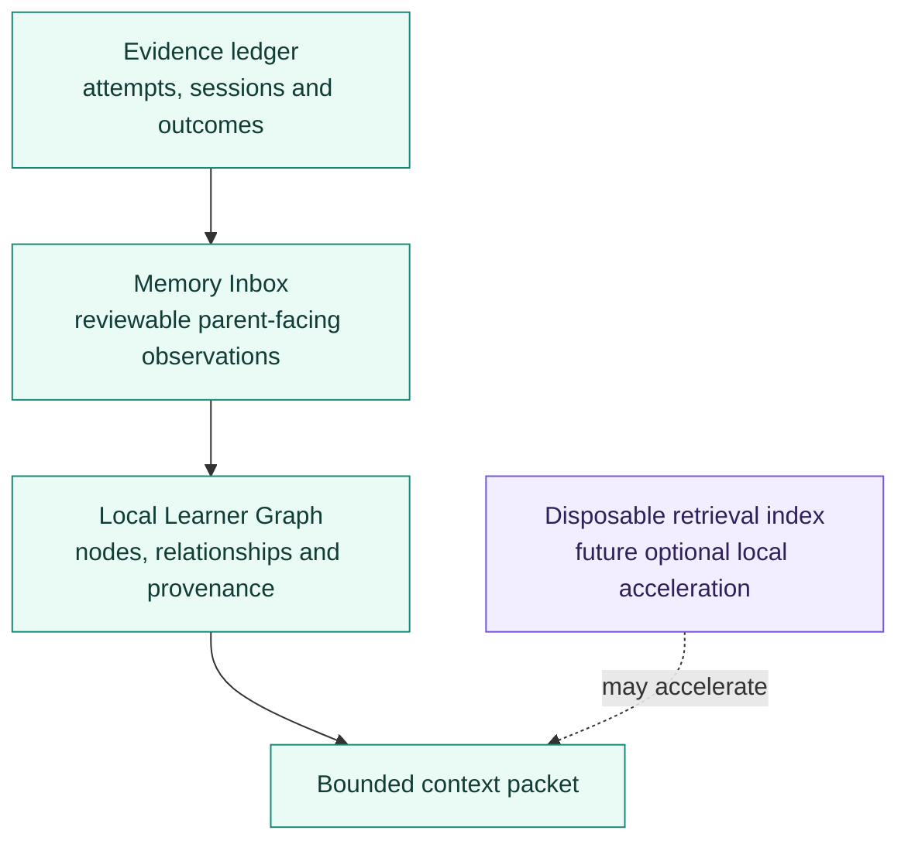
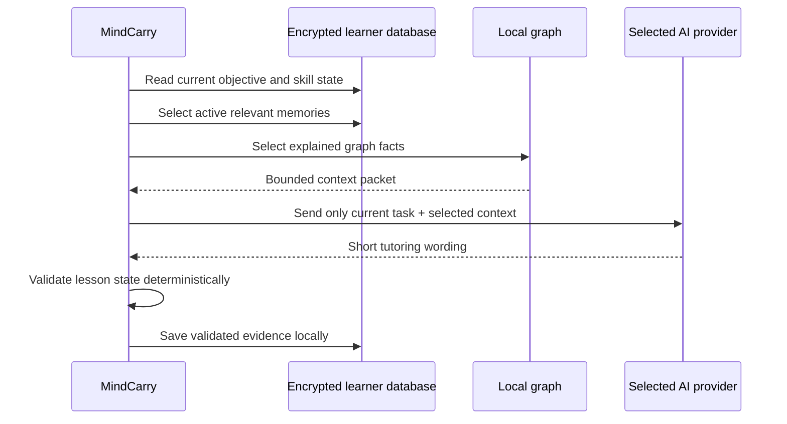
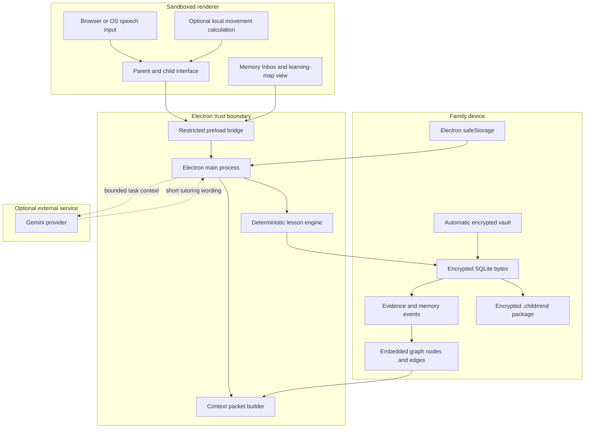

<div align="center">

# MindCarry

### The AI tutor that learns how each child learns

**A local-first tutoring system with an encrypted, portable Learner Memory Inbox and learning graph.**

[](https://github.com/inbharatai/mindcarry/actions/workflows/ci.yml)
[](https://github.com/inbharatai/mindcarry/actions/workflows/codeql.yml)
[](#current-status)
[](#learner-memory-architecture)
[](#local-learner-graph)

[Vision](#what-mindcarry-is) · [Status](#current-status) · [Memory](#learner-memory-architecture) · [Architecture](#system-architecture) · [Privacy](#privacy-boundary) · [Run](#run-mindcarry-locally) · [Test](#acceptance-test)

</div>

---

> [!IMPORTANT]
> **MindCarry is pre-MVP.** The repository contains the desktop implementation of the first tutoring, encrypted-memory, Memory Inbox and portability loop. Automated tests do not replace target-device testing with a real Gemini key, microphone, optional camera, restart persistence, a second clean installation and supervised family use.

## What MindCarry is

MindCarry is being built for children aged **5–10** learning foundational reading, writing and maths.

A useful tutor should not treat every lesson as a new chat. Over time it should understand:

- what the child has mastered;
- which misconceptions recur;
- whether an answer was independent or prompted;
- which explanation or representation helped;
- what should be reviewed next;
- which observations are uncertain, confirmed or outdated.

The accumulated understanding is stored in a **Learner Memory controlled by the family**, not in an AI provider's conversation history.

<table>
<tr>
<td width="25%" align="center"><strong>Private</strong><br/><sub>Sensitive records are encrypted locally.</sub></td>
<td width="25%" align="center"><strong>Portable</strong><br/><sub>The complete memory moves as one <code>.childmind</code> file.</sub></td>
<td width="25%" align="center"><strong>Model-independent</strong><br/><sub>Gemini is optional and replaceable.</sub></td>
<td width="25%" align="center"><strong>Evidence-led</strong><br/><sub>Assessment and permanent writes remain application-controlled.</sub></td>
</tr>
</table>

## Product loop

```mermaid
flowchart LR
    CHILD[Child responds] --> ASSESS[Deterministic assessment]
    ASSESS --> EVIDENCE[Structured lesson evidence]
    EVIDENCE --> INBOX[Parent-facing Memory Inbox]
    INBOX --> GRAPH[Local Learner Graph]
    GRAPH --> CONTEXT[Relevant context packet]
    CONTEXT --> PROVIDER[Gemini, another API or local model]
    PROVIDER --> TEACH[Short tutoring explanation]
    TEACH --> TRANSFER[Independent transfer check]
    TRANSFER --> EVIDENCE

    classDef child fill:#EEF4FF,stroke:#3157C8,color:#17233E;
    classDef trusted fill:#FFF8E8,stroke:#C48716,color:#4D3510;
    classDef memory fill:#EAFBF6,stroke:#138A78,color:#123D36;
    classDef provider fill:#F3EEFF,stroke:#7655D8,color:#30205C;

    class CHILD,TRANSFER child;
    class ASSESS,EVIDENCE trusted;
    class INBOX,GRAPH,CONTEXT memory;
    class PROVIDER,TEACH provider;
```



The model can change. The canonical learner evidence, inbox and graph remain with the family.

## Current status

| Capability | Repository status | Founder-device validation |
|---|---:|---:|
| Electron + React + TypeScript desktop shell | Implemented | Pending launch |
| Automatic application vault and learner folders | Implemented and tested | Pending path confirmation |
| Parent-passphrase database encryption | Implemented and tested | Pending local inspection |
| Encrypted device learner catalogue | Implemented and tested | Pending OS-store confirmation |
| Three-stage addition-within-20 lesson | Implemented and tested | Pending supervised use |
| Typed answers | Implemented | Pending UI test |
| Browser/OS speech recognition | Implemented where supported | Pending microphone test |
| Optional local movement cue | Implemented | Pending camera test |
| Parent-facing Memory Inbox | Implemented | Pending UI acceptance test |
| Deterministic local Learner Graph | Implemented and tested | Pending target-device inspection |
| Archive and restore memory items | Implemented and tested | Pending parent usability test |
| Bounded provider-independent context packet | Implemented and tested | Pending real-provider inspection |
| Gemini reteaching wording | Implemented | Pending real-key test |
| Deterministic fallback | Implemented | Pending offline test |
| `.childmind` export/import | Implemented and tested | Pending two-installation test |
| Windows package-layout build | Verified in CI | Pending launch on target PC |
| Gemini Live real-time voice | Not implemented | Planned |
| Reading, phonics and writing curriculum | Not implemented | Planned |
| Production child-safety and legal review | Not completed | Required before release |

## Learner Memory architecture

MindCarry separates four layers:



### Evidence ledger

The source of truth is structured evidence:

- question and answer;
- correctness;
- independent or prompted response;
- response time;
- misconception;
- intervention;
- transfer evidence;
- source session and timestamp.

A model does not directly write permanent learner labels.

### Memory Inbox

The parent can see:

- memory type and content;
- confidence and evidence count;
- source lesson;
- graph-connection count;
- confirmation date;
- active or archived status.

Archived memories are excluded from future lesson context but remain available for restoration and audit.

### Local Learner Graph

The graph is embedded inside the encrypted learner database. It does not require Neo4j, a cloud graph service, Graphify, a vector database or a provider-specific embedding model.

Current node kinds:

```text
learner · skill · interest · memory · session
```

Current relations:

```text
LEARNING_SKILL
INTERESTED_IN
SHOWED_SKILL_EVIDENCE
SHOWED_MISCONCEPTION
RESPONDED_TO_STRATEGY
HAS_LEARNING_PREFERENCE
HAS_OBSERVATION
ABOUT_SKILL
OBSERVED_DURING
```

Every edge records confidence, evidence count, source memory/session and provenance:

- `EXTRACTED` — explicitly present in canonical records;
- `DERIVED` — created by deterministic application rules;
- `PARENT` — reserved for future parent-confirmed relationships.

This design uses the useful knowledge-graph principles of deterministic extraction and explained relationships, while remaining purpose-built for learner evidence rather than importing a codebase-analysis system into the child-facing runtime.

## Provider-independent memory loading

Before each lesson, MindCarry creates a bounded local context packet:



The complete database, graph, passphrase and `.childmind` file are not sent to Gemini.

## Portable `.childmind` memory

The parent selects **Download complete memory** and receives one encrypted file:

```text
MindCarry-Learner-<short-id>-<date>.childmind
```

The file contains the already-encrypted learner database, including:

- profile and consent records;
- sessions and attempts;
- skills and mastery;
- Memory Inbox;
- memory-event audit history;
- graph nodes and edges;
- schema and package metadata.

It excludes:

- Gemini API key;
- operating-system credential-store data;
- device catalogue key;
- plaintext child name and age in the external manifest.

On import, MindCarry validates the package, asks for the original passphrase, verifies the database locally, migrates the schema and rebuilds the deterministic graph.

## Automatic encrypted vault

Parents do **not** create, name or connect folders manually.

On first launch, MindCarry creates:

```text
app.getPath("userData")/MindCarryVault
```

The exact path is shown in **Settings → Automatic local vault**.

<details>
<summary><strong>Generated structure</strong></summary>

```text
MindCarryVault/
├── vault.json
├── settings.json
├── learner-catalog.enc
├── learners/
│   └── <learner-uuid>/
│       ├── manifest.json
│       ├── learner.db.enc
│       ├── backups/
│       ├── media/
│       ├── handwriting/
│       ├── pronunciation/
│       └── session-cache/
├── exports/
├── backups/
├── recovery/
└── temp/
```

</details>

Sensitive learner information, the inbox and graph live inside `learner.db.enc`. The visible `manifest.json` contains technical metadata and no child name or age.

### Encryption design

- AES-256-GCM authenticated encryption;
- 256-bit key derived from the parent passphrase with asynchronous scrypt;
- random salt and IV;
- learner UUID bound as authenticated associated data;
- atomic encrypted-file replacement;
- rotating encrypted backups;
- SQLite integrity verification after decryption;
- passphrase never persisted by MindCarry.

> [!CAUTION]
> The current pre-MVP cannot recover a forgotten parent passphrase. Production recovery and passphrase-change design remain open release gates.

## Privacy boundary

### Remains local

- complete learner profile and parent goal;
- answers, attempts and mastery;
- sessions and structured memories;
- Memory Inbox and archive state;
- graph nodes, edges and provenance;
- parent passphrase;
- encrypted backups and `.childmind` exports;
- local camera-frame processing in the current experiment.

### May be sent when Gemini is enabled

Only a bounded current-task packet:

- current question;
- learner age;
- one relevant interest;
- observed misconception;
- one teaching strategy;
- selected active memory context.

Raw camera frames, the complete database, graph export, passphrase and API key are not included.

## System architecture



## Run MindCarry locally

### Requirements

- Windows 10/11, macOS or supported Linux desktop;
- Node.js **22.12 or newer**;
- Git;
- internet access for dependency installation and optional Gemini use.

### Windows automated setup

```powershell
Set-ExecutionPolicy -Scope Process Bypass
.\INSTALL_TO_DESKTOP.ps1
```

The installer locates the Desktop, installs missing Git/Node through `winget`, clones or updates the repository, runs verification and starts MindCarry only after checks pass.

### Existing clone

```powershell
cd C:\Users\reetu\Desktop\MindCarry
git checkout main
git pull --ff-only origin main
powershell -ExecutionPolicy Bypass -File .\setup-windows.ps1
```

### Manual setup

```bash
git clone https://github.com/inbharatai/mindcarry.git
cd mindcarry
npm install --no-audit --no-fund
npm run check
npm run dev
```

MindCarry starts in deterministic demo mode without an API key.

## Add a Gemini test key

Inside MindCarry:

1. Open **Settings**.
2. Confirm **Automatic local vault** displays **Vault ready**.
3. Paste the Gemini test API key.
4. Select **Save securely and test Gemini**.
5. Complete a lesson with synthetic learner data.
6. Inspect the Memory Inbox and AI Context Preview.

> [!WARNING]
> Never place an API key in GitHub, source code, chat, `.env`, logs, screenshots or a `.childmind` package.

## Acceptance test

Use a synthetic learner:

| Field | Test value |
|---|---|
| Name | Aarav |
| Age | 7 |
| Interest | Dinosaurs |
| Parent goal | Build confidence in foundational maths |
| Camera | Off initially |
| Raw audio/video storage | Off |

Then:

1. Create the learner and confirm the private vault is automatic.
2. Complete the three-question maths lesson.
3. Confirm a memory item appears in the Memory Inbox.
4. Confirm graph nodes and explained edges appear.
5. Confirm the AI Context Preview contains only bounded relevant memory.
6. Archive the memory and confirm it is removed from future context.
7. Restore it.
8. Lock, close and reopen MindCarry.
9. Confirm inbox and graph persist.
10. Test Gemini success and deterministic fallback.
11. Export the `.childmind` package.
12. Import it into a clean second installation.
13. Unlock with the original passphrase.
14. Confirm the inbox, graph and context return.
15. Confirm the second installation did not inherit the Gemini key.

See [`docs/demo-script.md`](docs/demo-script.md) and [`docs/memory-inbox-and-graph.md`](docs/memory-inbox-and-graph.md).

## Automated verification

Coverage includes:

- encryption and wrong-passphrase rejection;
- ciphertext tampering and associated-data mismatch rejection;
- encrypted learner catalogue;
- automatic vault creation;
- misconception and mastery logic;
- encrypted close/reopen persistence;
- PII exclusion from plaintext manifests;
- Memory Inbox generation;
- deterministic graph nodes, edges and provenance;
- archive and restore context behaviour;
- bounded context packet generation;
- `.childmind` transfer of inbox and graph;
- TypeScript/Vite build;
- Windows package-layout verification;
- CodeQL JavaScript/TypeScript analysis.

## Repository map

```text
mindcarry/
├── electron/
│   ├── main.cjs
│   ├── preload.cjs
│   └── services/
│       ├── aiProvider.cjs
│       ├── catalogStore.cjs
│       ├── crypto.cjs
│       ├── learnerMemoryStore.cjs
│       ├── lessonEngine.cjs
│       ├── memoryGraph.cjs
│       ├── memoryStore.cjs
│       ├── schema.cjs
│       └── vaultManager.cjs
├── src/
│   ├── App.tsx
│   ├── components/
│   │   ├── MemoryInbox.tsx
│   │   └── MemoryInbox.css
│   ├── lib/
│   └── types/
├── tests/
├── scripts/
├── docs/
├── INSTALL_TO_DESKTOP.ps1
├── setup-windows.ps1
└── package.json
```

`memoryStore.cjs` remains the encrypted persistence and portability core. `learnerMemoryStore.cjs` adds inbox, graph, parent controls and provider-independent retrieval without weakening the storage boundary.

## Current limitations

- MindCarry remains pre-MVP until target-device acceptance testing passes.
- The implemented curriculum is limited to addition within 20.
- Browser/OS speech recognition is not Gemini Live.
- The camera experiment measures movement intensity only.
- The database uses SQL.js persisted as encrypted bytes, not SQLCipher.
- Parent memory rewriting, permanent deletion and secure erasure are not implemented.
- Passphrase change and recovery are not implemented.
- The graph ontology currently covers only the first maths vertical slice.
- There is no semantic/vector index; this is deliberate in phase one.
- Releases are not code-signed and there is no secure auto-update channel.
- No Vercel or Cloudflare deployment can replace the local desktop memory architecture.
- No claim is made that the prototype satisfies every child-data law before jurisdiction-specific legal review.

## Documentation

- [`ABOUT.md`](ABOUT.md) — product purpose and honest stage
- [`PROJECT_STATUS.md`](PROJECT_STATUS.md) — implementation and validation gates
- [`docs/architecture.md`](docs/architecture.md) — trust boundaries
- [`docs/local-vault.md`](docs/local-vault.md) — automatic folders and encryption
- [`docs/memory-inbox-and-graph.md`](docs/memory-inbox-and-graph.md) — canonical memory and graph design
- [`docs/privacy-model.md`](docs/privacy-model.md) — local/provider boundary
- [`docs/threat-model.md`](docs/threat-model.md) — risks and controls
- [`docs/security-audit.md`](docs/security-audit.md) — audit findings and release gates
- [`docs/demo-script.md`](docs/demo-script.md) — end-to-end acceptance test
- [`docs/roadmap.md`](docs/roadmap.md) — evidence-based roadmap
- [`SECURITY.md`](SECURITY.md) — vulnerability reporting

---

<div align="center">

### MindCarry should not only remember what a child learned.
### It should gradually learn how that specific child learns best—without taking that memory away from the family.

</div>