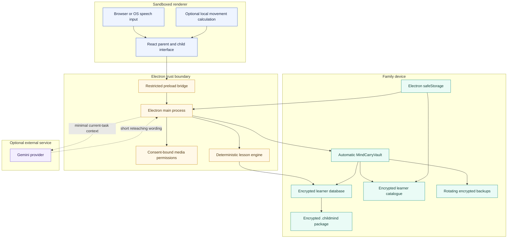
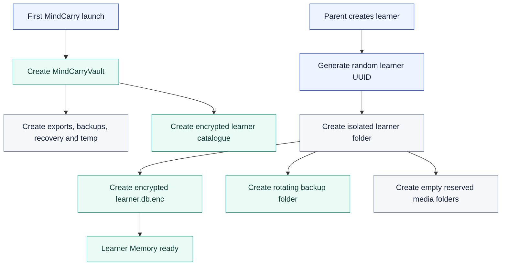
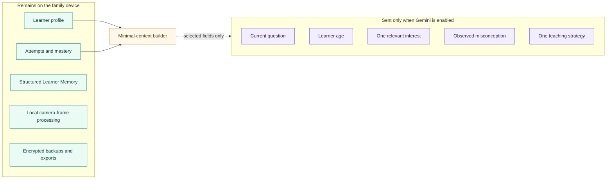
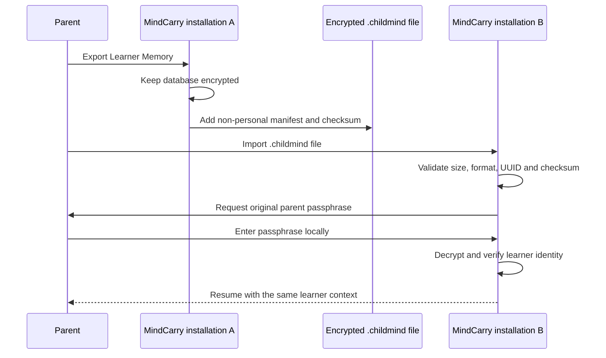
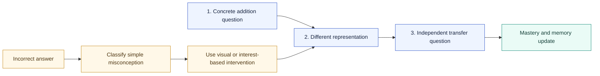
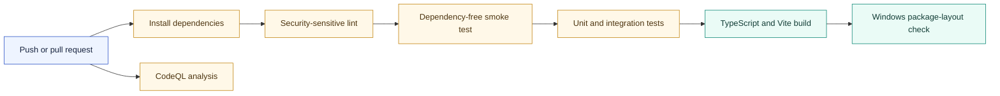
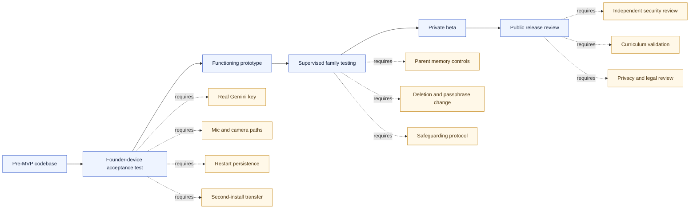

<div align="center">

# MindCarry

### The AI tutor that learns how each child learns

**A local-first tutoring system with encrypted, portable Learner Memory.**

[](https://github.com/inbharatai/mindcarry/actions/workflows/ci.yml)
[](https://github.com/inbharatai/mindcarry/actions/workflows/codeql.yml)
[](#current-status)
[](#run-mindcarry-locally)
[](#automatic-encrypted-vault)
[](#add-a-gemini-test-key)

[Vision](#what-mindcarry-is) · [Status](#current-status) · [Architecture](#system-architecture) · [Privacy](#privacy-and-ai-provider-boundary) · [Run locally](#run-mindcarry-locally) · [Test plan](#acceptance-test-scenario)

</div>

---

> [!IMPORTANT]
> **MindCarry is pre-MVP.** The repository contains a hardened desktop implementation of the first learning-memory loop, automated tests and Windows/Linux verification. It has not yet completed the full founder-device acceptance test with a real Gemini key, microphone, optional camera, restart persistence and transfer to a second clean installation. It is not a production child-facing product.

## What MindCarry is

MindCarry is being built for children aged **5–10** learning foundational reading, writing and maths.

A useful tutor should not treat every lesson as a new chat. It should gradually understand:

- what the child has mastered;
- where the child hesitates;
- which misconceptions recur;
- whether an answer was independent or heavily prompted;
- which explanation improved understanding;
- what should be reviewed next.

MindCarry stores that accumulated understanding in a **Learner Memory** controlled by the family rather than using an AI provider's conversation history as the permanent source of truth.

<table>
<tr>
<td width="25%" align="center"><strong>Private by design</strong><br/><sub>Sensitive learner records are encrypted locally.</sub></td>
<td width="25%" align="center"><strong>Portable</strong><br/><sub>Learner Memory can move as a <code>.childmind</code> package.</sub></td>
<td width="25%" align="center"><strong>Model-independent</strong><br/><sub>Gemini is optional and replaceable.</sub></td>
<td width="25%" align="center"><strong>Evidence-led</strong><br/><sub>Assessment logic remains deterministic.</sub></td>
</tr>
</table>

## The central idea

```mermaid
flowchart LR
    CHILD[Child responds] --> ASSESS[Deterministic assessment]
    ASSESS --> MISCONCEPTION[Identify misconception]
    MISCONCEPTION --> INTERVENTION[Choose a teaching intervention]
    INTERVENTION --> EXPLAIN[Optional Gemini wording]
    EXPLAIN --> TRANSFER[Independent transfer question]
    TRANSFER --> MEMORY[Encrypted Learner Memory]
    MEMORY --> NEXT[Relevant context next session]

    classDef child fill:#EEF4FF,stroke:#3157C8,color:#17233E,stroke-width:1.5px;
    classDef logic fill:#F4F7FB,stroke:#64748B,color:#17233E,stroke-width:1.5px;
    classDef ai fill:#F3EEFF,stroke:#7655D8,color:#30205C,stroke-width:1.5px;
    classDef memory fill:#EAFBF6,stroke:#138A78,color:#123D36,stroke-width:1.5px;

    class CHILD child;
    class ASSESS,MISCONCEPTION,INTERVENTION,TRANSFER logic;
    class EXPLAIN ai;
    class MEMORY,NEXT memory;
```



The AI model can change. The child's accumulated learning context should remain with the family.

## First prototype goal

The first complete prototype must prove one narrow end-to-end loop:

1. A parent creates a learner profile.
2. MindCarry creates every required application and learner folder automatically.
3. The learner completes a short voice-enabled addition lesson.
4. MindCarry identifies a misconception using deterministic assessment logic.
5. It changes the representation and asks another question.
6. The learner completes an independent transfer question.
7. The result is written to encrypted local Learner Memory.
8. MindCarry closes and reopens without losing the learner state.
9. The learner is exported as an encrypted `.childmind` package.
10. A second clean installation imports the package and resumes with the same learner context.

## Current status

| Capability | Repository status | Founder-device validation |
|---|---:|---:|
| Electron + React + TypeScript desktop shell | Implemented | Pending launch |
| Automatic application vault | Implemented and tested | Pending path confirmation |
| Automatic UUID-based learner folders | Implemented and tested | Pending path confirmation |
| Parent-passphrase encryption | Implemented and tested | Pending local inspection |
| Encrypted device learner catalogue | Implemented and tested | Pending OS-store confirmation |
| Three-stage addition lesson | Implemented and tested | Pending supervised use |
| Typed answers | Implemented | Pending UI test |
| Browser/OS speech recognition | Implemented where supported | Pending microphone test |
| Optional local movement cue | Implemented | Pending camera test |
| Gemini reteaching wording | Implemented | Pending real-key test |
| Deterministic Gemini fallback | Implemented and tested in code path | Pending offline test |
| `.childmind` export/import | Implemented and tested | Pending two-installation test |
| Windows package-layout build | Verified in CI | Pending launch on target PC |
| Gemini Live real-time voice | Not implemented | Planned |
| Reading and phonics curriculum | Not implemented | Planned |
| Writing support | Not implemented | Planned |
| Production child-safety review | Not completed | Required before release |

## System architecture

MindCarry separates the interface, security boundary, teaching logic, local memory and optional AI provider.



### Technology stack

| Layer | Technology |
|---|---|
| Desktop | Electron |
| Interface | React + TypeScript |
| Development/build | Vite |
| Local database | SQL.js / SQLite exported as encrypted bytes |
| Cryptography | Node.js crypto, AES-256-GCM and scrypt |
| AI provider | Google Gen AI JavaScript SDK |
| Testing | Vitest + dependency-free smoke test |
| Packaging | electron-builder |
| Automation | GitHub Actions on Windows and Linux |
| Static security analysis | CodeQL |

## Automatic encrypted vault

Parents do **not** create, name, connect or maintain folders manually.

On first launch, MindCarry creates a `MindCarryVault` inside Electron's operating-system-specific application-data directory:

```text
app.getPath("userData")/MindCarryVault
```

The exact path is displayed inside **Settings → Automatic local vault**, where it can also be opened through the operating system.



<details>
<summary><strong>View the complete generated folder structure</strong></summary>

```text
MindCarryVault/
├── vault.json                 # Technical descriptor; no learner PII
├── settings.json              # Contains OS-encrypted key envelopes and non-secret settings
├── learner-catalog.enc        # Encrypted local learner list
├── learners/
│   └── <learner-uuid>/
│       ├── manifest.json      # Technical metadata; no child name or age
│       ├── learner.db.enc     # Encrypted SQLite learner database
│       ├── backups/           # Rotating encrypted database backups
│       ├── media/             # Reserved; raw media storage remains disabled
│       ├── handwriting/       # Reserved for future consented samples
│       ├── pronunciation/     # Reserved for future consented samples
│       └── session-cache/     # Temporary lesson-state location
├── exports/                   # Default .childmind export location
├── backups/
├── recovery/
└── temp/
```

</details>

### What is encrypted

Sensitive learner information is stored inside `learner.db.enc`, including:

- child name and age;
- interests and parent goals;
- consent choices;
- answers, attempts and response times;
- misconceptions and teaching interventions;
- mastery records;
- session summaries;
- structured learner memories.

The local learner list is also encrypted in `learner-catalog.enc` with a separate random device key protected by Electron `safeStorage`.

### Encryption design

- authenticated **AES-256-GCM** encryption;
- 256-bit key derived from the parent passphrase with asynchronous **scrypt**;
- random salt and IV for every encrypted database write;
- learner UUID used as authenticated associated data;
- atomic encrypted-file replacement;
- rotating encrypted backups;
- SQLite integrity verification after decryption;
- versioned encryption envelope with legacy read support;
- passphrase never persisted by MindCarry.

> [!CAUTION]
> The current pre-MVP cannot recover a forgotten parent passphrase. This is deliberate, but production recovery and passphrase-change design still require further work.

> [!NOTE]
> `MindCarryVault` is not an encrypted virtual drive. Sensitive application records are protected through file-level authenticated encryption. Reserved media folders remain empty in the current build because raw audio and raw video storage are disabled.

## Learner Memory lifecycle

MindCarry should retain evidence, not unlimited conversation history.

```mermaid
flowchart LR
    CAPTURE[Capture answer and lesson evidence] --> CLASSIFY[Classify skill, misconception and intervention]
    CLASSIFY --> VALIDATE[Validate with deterministic rules]
    VALIDATE --> CONFIDENCE[Assign bounded confidence]
    CONFIDENCE --> STORE[Write encrypted structured memory]
    STORE --> RETRIEVE[Retrieve only relevant context]
    RETRIEVE --> CONFIRM[Confirm or contradict in later sessions]
    CONFIRM --> CONSOLIDATE[Increase evidence count or revise]

    classDef input fill:#EEF4FF,stroke:#3157C8,color:#17233E;
    classDef process fill:#FFF8E8,stroke:#C48716,color:#4D3510;
    classDef memory fill:#EAFBF6,stroke:#138A78,color:#123D36;

    class CAPTURE input;
    class CLASSIFY,VALIDATE,CONFIDENCE,CONFIRM,CONSOLIDATE process;
    class STORE,RETRIEVE memory;
```



The current alpha stores bounded, structured observations such as:

- a recurring addition misconception;
- completion of an independent transfer question;
- whether a personalised theme was used during reteaching;
- a confidence value and evidence count;
- the next recommended learning step.

It does not ask a model to write directly to the database.

## Privacy and AI-provider boundary

MindCarry is **local-first**, not fully offline when Gemini is enabled.



### Stays local

- complete learner profile and parent goal;
- mastery and progress records;
- answer history and misconceptions;
- session summaries;
- structured learner memories;
- encrypted backups and `.childmind` exports;
- camera-frame processing in the current experiment;
- parent passphrase.

### Sent to Gemini when enabled

Only limited context required for one short reteaching explanation:

- current question;
- learner age;
- one relevant interest;
- observed misconception;
- one teaching strategy.

The implementation does **not** send Gemini the complete learner database, parent passphrase, raw camera frames, encrypted package or device catalogue.

### API-key protection

The Gemini key is:

- entered only inside MindCarry Settings;
- tested before Gemini mode is enabled;
- encrypted through Electron `safeStorage`;
- kept outside learner folders;
- excluded from `.childmind` exports;
- never intended for source code, `.env` files, logs or screenshots.

## Portable Learner Memory

A `.childmind` file is a transport package for the already-encrypted learner database.



The package includes:

- encrypted learner database;
- non-personal technical manifest;
- package and schema versions;
- integrity checksum.

It excludes:

- Gemini API key;
- device catalogue key;
- operating-system credentials;
- plaintext child name or age;
- readable lesson records.

An imported profile appears as **Imported learner** until the correct parent passphrase decrypts and verifies the database.

## Tutoring logic in the current build

The current curriculum is deliberately narrow: **addition within 20**.

The lesson contains three stages:



The engine supports:

- typed numerical answers;
- spoken English number words through twenty;
- simple off-by-one and strategy-not-secure classification;
- response time and hint tracking;
- interest-based examples;
- independent-transfer evidence;
- mastery caps when evidence is insufficient;
- deterministic fallback when Gemini is unavailable.

Gemini can rephrase a short explanation after an incorrect answer. It does not decide correctness, control lesson progression or write directly to Learner Memory.

## Multimodal personalisation boundary

The long-term vision includes voice, pronunciation, spoken reasoning, response time, posture and observable engagement cues—with explicit parental permission.

The current camera experiment is deliberately narrow. It calculates a smoothed frame-to-frame movement value locally and does **not**:

- recognise or identify faces;
- infer demographic traits, personality or emotion;
- diagnose attention, ADHD, autism or any condition;
- upload camera frames;
- save raw video;
- compare children against a universal behavioural norm.

Behavioural cues are temporary teaching signals, not medical or psychological conclusions.

## Run MindCarry locally

### Requirements

- Windows 10/11, macOS or a supported Linux desktop;
- Node.js **22.12 or newer**;
- Git;
- internet access for initial dependency installation and optional Gemini use.

### Windows: automated Desktop installation

The automated installer creates or updates:

```text
C:\Users\<Windows-user>\Desktop\MindCarry
```

Download and inspect [`INSTALL_TO_DESKTOP.ps1`](INSTALL_TO_DESKTOP.ps1), then run it from PowerShell:

```powershell
Set-ExecutionPolicy -Scope Process Bypass
.\INSTALL_TO_DESKTOP.ps1
```

The script:

1. locates the real Windows Desktop automatically;
2. installs Git and Node.js LTS with `winget` when missing;
3. creates the Desktop source folder by cloning this repository;
4. updates an existing clean clone safely;
5. installs the pinned direct dependencies;
6. runs linting, cryptography tests, integration tests and the production build;
7. starts MindCarry only after verification succeeds.

### Existing Desktop clone

```powershell
cd C:\Users\reetu\Desktop\MindCarry
git checkout main
git pull --ff-only origin main
powershell -ExecutionPolicy Bypass -File .\setup-windows.ps1
```

### Manual cross-platform setup

```bash
git clone https://github.com/inbharatai/mindcarry.git
cd mindcarry
npm install --no-audit --no-fund
npm run check
npm run dev
```

MindCarry starts in deterministic **demo mode** without an API key.

## Add a Gemini test key

After the application opens:

1. Open **Settings**.
2. Confirm **Automatic local vault** displays **Vault ready**.
3. Paste the Gemini test API key.
4. Select **Save securely and test Gemini**.
5. Confirm the connection test succeeds.
6. Return to the learner profile and run the lesson.

> [!WARNING]
> Do not place the API key in GitHub, source code, a chat message, an `.env` file or a learner export.

The current provider is configured to use `gemini-2.5-flash` for short reteaching explanations. Gemini Live voice is a separate future phase.

## Acceptance-test scenario

Use a synthetic learner:

| Field | Test value |
|---|---|
| Name | Aarav |
| Age | 7 |
| Interest | Dinosaurs |
| Parent goal | Build confidence in foundational maths |
| Camera | Off initially |
| Raw audio/video storage | Off |

Then complete this sequence:

1. Answer `11` to `7 + 5`.
2. Confirm an off-by-one misconception is recorded.
3. Confirm the tutor changes its explanation.
4. Complete the second question independently.
5. Complete the final transfer question independently.
6. Review mastery and structured memories.
7. Lock, close and reopen MindCarry.
8. Confirm the history remains.
9. Add and validate the Gemini key.
10. Disconnect the network and confirm deterministic fallback.
11. Test microphone permission allowed and denied.
12. Test camera permission allowed and denied.
13. Confirm the camera stops after lesson cancellation and learner lock.
14. Export the `.childmind` package.
15. Import it into a second clean installation.
16. Unlock it using the original parent passphrase.
17. Confirm the second installation did not inherit the Gemini key.

See [`docs/demo-script.md`](docs/demo-script.md) for the detailed pass/fail procedure.

## Automated verification



Automated coverage includes:

- encryption round trip;
- wrong-passphrase rejection;
- associated-data mismatch rejection;
- ciphertext tampering rejection;
- encrypted learner catalogue;
- automatic vault and learner-folder creation;
- atomic writes and rotating backups;
- spoken-number parsing;
- misconception and intervention logic;
- transfer-based mastery rules;
- encrypted close/reopen persistence;
- absence of child PII from plaintext manifests;
- `.childmind` export/import across two simulated installations;
- TypeScript production build;
- Windows package-layout verification;
- CodeQL JavaScript/TypeScript analysis.

Automated tests do not replace real child, parent, accessibility, microphone, camera or model-behaviour testing.

## Development commands

| Command | Purpose |
|---|---|
| `npm run dev` | Start Vite and Electron in development mode |
| `npm run lint` | Lint the security-sensitive Node/Electron code |
| `npm run test:core` | Run dependency-free encryption and lesson smoke tests |
| `npm test` | Run unit and integration tests |
| `npm run build` | Type-check and build the renderer |
| `npm run check` | Run the complete local verification pipeline |
| `npm run pack` | Verify and create an unpacked application build |
| `npm run dist` | Verify and create platform packages |

## Repository map

```text
mindcarry/
├── electron/
│   ├── main.cjs                    # Trusted main process and IPC handlers
│   ├── preload.cjs                 # Restricted renderer bridge
│   └── services/
│       ├── aiProvider.cjs          # Demo and Gemini provider adapters
│       ├── catalogStore.cjs        # Encrypted local learner catalogue
│       ├── crypto.cjs              # Encryption envelope and key derivation
│       ├── lessonEngine.cjs        # Deterministic assessment and mastery
│       ├── memoryStore.cjs         # Encrypted SQLite learner memory
│       ├── schema.cjs              # Versioned local database schema
│       └── vaultManager.cjs        # Automatic folder and backup management
├── src/
│   ├── App.tsx                     # Parent, learner and lesson interface
│   ├── components/                 # Camera observer and UI components
│   ├── lib/                        # Speech helper
│   └── types/                      # Typed preload/API contracts
├── tests/                          # Crypto, vault, memory and lesson tests
├── scripts/                        # Dependency-free smoke test
├── docs/                           # Architecture, privacy and test documents
├── INSTALL_TO_DESKTOP.ps1          # One-command Windows installer
├── setup-windows.ps1               # Existing-clone verification and launch
└── package.json                    # Scripts, dependencies and packaging
```

## Electron security posture

The application window uses:

- `nodeIntegration: false`;
- `contextIsolation: true`;
- renderer sandboxing;
- a restricted preload bridge;
- IPC sender validation;
- blocked arbitrary navigation and new windows;
- consent-bound media permission handlers;
- a restrictive Content Security Policy;
- no arbitrary renderer filesystem access.

Before public use, MindCarry still requires independent security, safeguarding, privacy/legal, curriculum, accessibility and model-behaviour review, as well as code-signed releases and a secure update mechanism.

## Roadmap and evidence gates



The repository status and release gates are maintained in [`PROJECT_STATUS.md`](PROJECT_STATUS.md) and [`docs/roadmap.md`](docs/roadmap.md).

## Current limitations

- MindCarry remains pre-MVP until target-device acceptance testing passes.
- The implemented curriculum is limited to addition within 20.
- Browser/OS speech recognition is not Gemini Live voice.
- The camera experiment measures movement intensity only.
- The database uses SQL.js persisted as encrypted bytes, not SQLCipher.
- Gemini generates short reteaching wording rather than controlling lesson state.
- Parent memory correction, selective deletion, learner deletion and passphrase change are not complete.
- Backup restore is tested at the storage layer but does not yet have a parent-facing restore interface.
- A dependency lockfile is still required for fully reproducible installs.
- `.childmind` currently uses a checksum for corruption detection; cryptographic package signing is a later hardening step.
- Releases are not yet code-signed and there is no secure auto-update channel.
- No Vercel deployment is configured.
- No claim is made that the prototype satisfies every child-data law before jurisdiction-specific legal review.

## Documentation

- [`ABOUT.md`](ABOUT.md) — product purpose and honest stage
- [`PROJECT_STATUS.md`](PROJECT_STATUS.md) — implementation and validation gates
- [`docs/architecture.md`](docs/architecture.md) — architecture and trust boundaries
- [`docs/local-vault.md`](docs/local-vault.md) — automatic folders and encryption
- [`docs/privacy-model.md`](docs/privacy-model.md) — local/provider data boundary
- [`docs/threat-model.md`](docs/threat-model.md) — risks and controls
- [`docs/security-audit.md`](docs/security-audit.md) — audit findings and release gates
- [`docs/demo-script.md`](docs/demo-script.md) — end-to-end acceptance test
- [`docs/roadmap.md`](docs/roadmap.md) — evidence-based roadmap
- [`SECURITY.md`](SECURITY.md) — vulnerability reporting

## Deployment note

MindCarry is currently a local Electron application. Vercel is intentionally not configured. A future public website or waitlist may be hosted separately, but the local Learner Memory architecture must not be replaced accidentally by a cloud database.

---

<div align="center">

### MindCarry should not only remember what a child learned.
### It should gradually learn how that specific child learns best.

</div>
