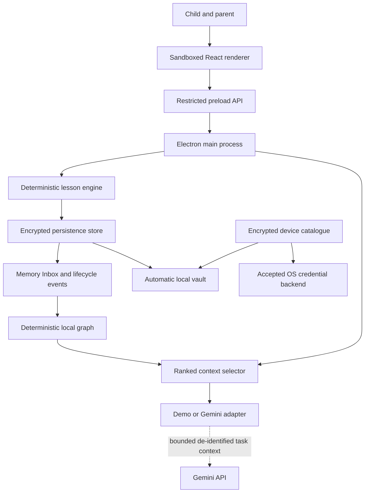
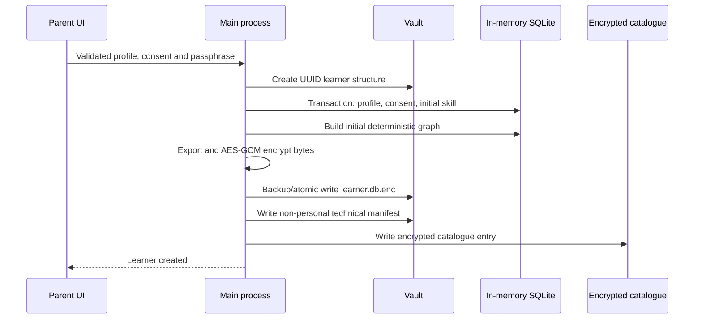

# Architecture

MindCarry is a desktop-first, local-memory pre-MVP. The Electron main process owns every privileged operation. The React renderer is untrusted presentation code and receives only named capabilities through the preload bridge.

## System overview



## Renderer boundary

Responsibilities:

- parent and child interface;
- typed input;
- supported browser/OS speech recognition and speech synthesis;
- optional local camera-frame movement calculation;
- rendering progress, Memory Inbox, graph and parent-visible context.

Restrictions:

- no Node integration or direct filesystem access;
- no direct Electron/key/database access;
- no arbitrary IPC channel;
- no external renderer network connection;
- production DevTools disabled;
- arbitrary navigation/new windows denied.

IPC is accepted only from the exact configured development origin or the exact packaged `dist/index.html` file.

## Preload API

`electron/preload.cjs` exposes only:

- app status and vault-folder opening;
- Gemini-key set/remove/test;
- learner list/create/unlock/dashboard/lock/export/import;
- Inbox/graph read and memory archive/restore;
- lesson start/answer/cancel.

The bridge does not expose `ipcRenderer`, shell, filesystem or arbitrary invocation.

## Main-process responsibilities

- validate renderer sender and all arguments;
- create/manage vault and encrypted catalogue;
- accept only secure OS credential backends;
- encrypt/decrypt learner databases;
- enforce session ownership, one active lesson and one answer operation at a time;
- assess answers and mastery deterministically;
- build Inbox, graph and ranked context;
- store/test Gemini key and perform optional provider requests;
- control media permissions;
- validate import/export paths and package structure.

## Learner Memory layers

### 1. Evidence ledger

Canonical structured data includes profile, consent, skills, sessions, attempts, misconceptions, interventions, transfer outcomes and optional consented movement events.

The model cannot decide correctness, advance lesson state or write permanent data directly.

### 2. Memory Inbox

The parent-visible `memories` view includes content, type, confidence, evidence count, source, dates and active/archive state. Archiving excludes the item from future context. Repeated evidence may reinforce it but does not reactivate it. Restore is explicit.

### 3. Lifecycle ledger

`memory_events` records creation, reinforcement, archive and restore. Graph/event mutation is transactional before encrypted persistence.

### 4. Local graph

`memory_graph_nodes` and `memory_graph_edges` are inside the encrypted SQLite database. Nodes represent learner, skill, interest, memory and session. Edges store relation, confidence, evidence count, source and provenance.

The graph is deterministic and rebuildable; it is not a cloud service or canonical vector index.

### 5. Ranked context packet

Before each lesson, MindCarry ranks active memory and graph facts using objective/skill overlap, memory type, evidence, confidence, recency and review state.

Limits:

```text
8 memories
12 graph facts
1,800 provider-context characters
```

Two views are produced:

- `summaryText` — parent-visible local preview;
- `providerText` — bounded provider-safe view where learner-node identity is replaced with `Learner`.

The provider receives the current task plus `providerText`, age and at most one relevant interest. It does not receive the child name, complete DB/graph, passphrase, API key, raw media or export.

## Credential protection

The catalogue and Gemini key use Electron `safeStorage`. MindCarry rejects unavailable, Linux `basic_text` and unknown backends. On Windows, the target backend is DPAPI. Device credentials never travel in `.childmind`.

## Learner creation



Incomplete learner structures are removed after failure.

## Lesson lifecycle

1. Cancel a previous active lesson for that learner.
2. Build ranked context before the new session.
3. Create one active session.
4. Parse the final numeric answer from typed/spoken text.
5. Assess correctness, independence, hint use and misconception.
6. Optionally request short Gemini wording using provider-safe context.
7. Persist the attempt transactionally and atomically.
8. Require an independent transfer answer before completion.
9. Update mastery/memory transactionally.
10. Record lifecycle events, rebuild graph and persist encrypted bytes.

A main-process processing flag prevents concurrent duplicate answer handling. Renderer unmount/lock/cancel cleanup ends unfinished sessions and media.

## Persistence

SQL.js runs in main-process memory while unlocked. Each material update exports database bytes, encrypts them, rotates the previous encrypted file into backups, writes a destination-local temporary file, flushes and atomically renames it.

Unlock requires authenticated decryption, supported schema, SQLite integrity, one matching profile and a matching consent record.

## Media boundary

Camera permission is off by default and active only during a consented lesson. Frames remain in renderer memory; only a clamped movement number may be stored. Streams stop on cancel, lock, unmount and startup/play error. Raw audio/video storage is forced off.

## Portability

A `.childmind` package contains an already-encrypted database, technical manifest and checksum. Import validates total/payload size, package/manifest/schema versions, UUID, canonical base64, checksum and destination collision before writing.

After passphrase unlock the receiving installation verifies database identity, migrates schema, rebuilds graph and creates fresh context. It initially displays **Imported learner** and never imports Gemini/device keys.

## Web-hosting boundary

A public website may host product information or a controlled demo, but it is not the current learner-memory runtime. Moving canonical memory to Vercel, Cloudflare or another cloud would require an explicit privacy/security redesign.
