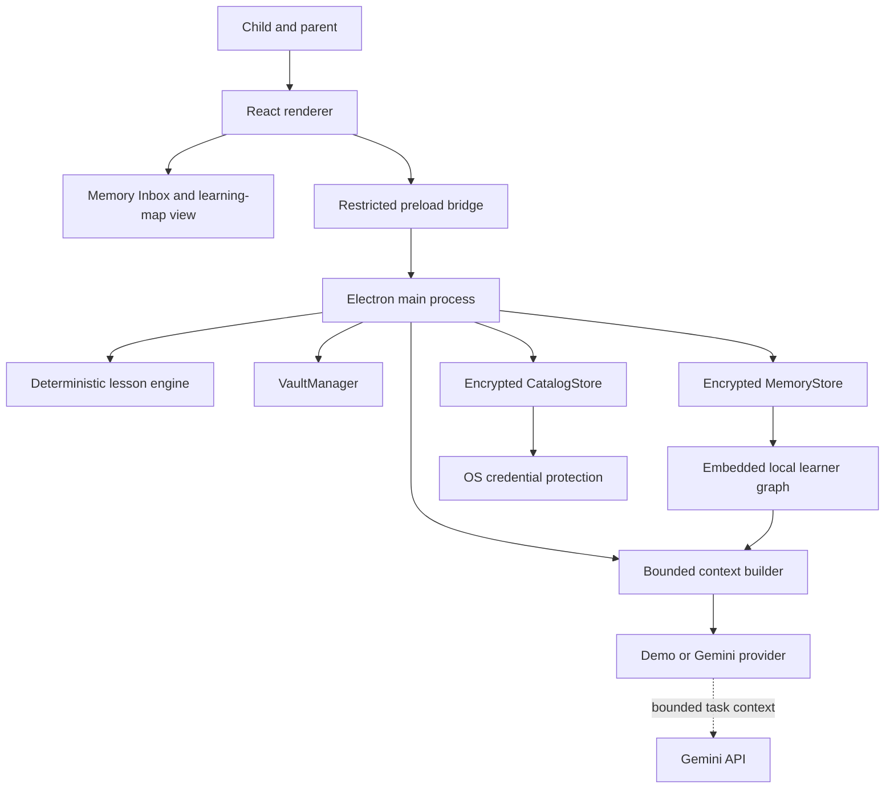
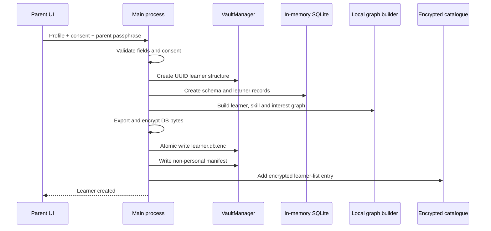

# Architecture

MindCarry is currently a desktop-first, local-memory prototype. The Electron main process owns every privileged operation. The React renderer is treated as untrusted presentation code and receives only a narrow capability API through the preload bridge.

## System overview

## Trust boundaries

### Renderer

Responsibilities:

- child and parent interface;
- typed lesson interaction;
- browser/OS speech recognition;
- optional camera frame processing;
- rendering local progress, Memory Inbox and graph summaries returned by the main process.

Restrictions:

- no Node.js integration;
- no direct filesystem access;
- no direct Electron APIs;
- no direct access to API keys;
- no direct learner-database access;
- no arbitrary IPC channel selection.

### Preload bridge

`electron/preload.cjs` exposes named methods only:

- application status and vault-folder opening;
- Gemini key management;
- learner create/list/unlock/lock/export/import;
- Memory Inbox and graph reads;
- memory archive and restore controls;
- lesson start/answer/cancel.

It does not expose `ipcRenderer`, filesystem, shell or arbitrary channel access.

### Electron main process

Responsibilities:

- IPC sender validation;
- input validation;
- media permission policy;
- vault creation;
- encryption and decryption;
- learner-database lifecycle;
- device catalogue protection;
- Memory Inbox and graph orchestration;
- bounded provider-independent context selection;
- model credential handling;
- Gemini requests;
- import/export dialogs;
- session state.

The main process is the only process allowed to write learner files, open the decrypted learner database or obtain the Gemini API key.

## Learner Memory layers

### Canonical evidence ledger

The permanent source of truth is structured lesson evidence:

- profile and consent;
- skills and mastery;
- lesson sessions;
- attempts and misconceptions;
- intervention and transfer outcomes;
- optional consented engagement events.

A model does not directly decide correctness, lesson progression or permanent database writes.

### Memory Inbox

The `memories` table presents bounded observations derived from validated evidence. The parent-facing Inbox includes confidence, evidence count, source lesson, confirmation date and active/archived state.

Archiving an item excludes it from future context without destroying the audit trail. Restoration makes it eligible again. Editing and permanent deletion remain future release gates.

### Memory event ledger

`memory_events` records material lifecycle events such as:

- created;
- reinforced;
- archived;
- restored.

This supports auditability and future parent controls without relying on an AI-generated narrative history.

### Embedded local learner graph

The graph is stored in the same encrypted SQLite database through:

- `memory_graph_nodes`;
- `memory_graph_edges`.

Node kinds currently include learner, skill, interest, memory and session. Edges record relation, confidence, evidence count, source memory/session and provenance.

Provenance values are:

- `EXTRACTED` — directly represented in canonical records;
- `DERIVED` — created by deterministic application rules;
- `PARENT` — reserved for future parent-confirmed relationships.

The graph is deterministic and rebuildable. It is not a separate cloud graph database and does not require a vector store.

### Decrypted-memory lifetime

Each learner database is created as SQLite in memory, exported to bytes and encrypted before disk persistence. The decrypted database exists only in Electron main-process memory while the learner is unlocked.

## Encrypted device catalogue

The home screen requires learner names before a parent unlocks a database. Those names are stored in `learner-catalog.enc`, not in plaintext manifests.

The catalogue uses a random 256-bit device key. Electron `safeStorage` protects the key using operating-system credential protection. The catalogue is device-specific and never exported.

## AI-provider boundary

The provider abstraction currently supports:

- deterministic local demo explanations;
- Gemini-generated short alternative explanations.

Before a lesson, MindCarry creates a bounded Learner Context Packet containing:

- current objective;
- a small set of skills;
- at most eight active relevant memory items;
- at most twelve graph facts;
- a short text summary.

The provider receives only selected context for the current task. The complete database, graph, passphrase and `.childmind` package are not supplied. The AI provider does not own lesson state, mastery logic or persistent memory, and its output cannot execute code or write directly to the database.

## Startup sequence

1. Electron reaches `app.whenReady()`.
2. `VaultManager` creates the complete runtime structure.
3. A device catalogue key is loaded or generated through `safeStorage`.
4. `CatalogStore` opens the encrypted learner list.
5. The encrypted persistence store loads SQL.js and performs legacy-manifest migration.
6. The secure BrowserWindow is created.
7. Media-permission and IPC handlers are registered.
8. The renderer requests status and the encrypted learner list.

## Learner creation sequence

Any failure removes the incomplete learner structure.

## Lesson orchestration

The current lesson is a deterministic three-stage vertical slice:

1. concrete addition question;
2. pictorial recheck;
3. independent transfer question.

The main process:

- builds the current bounded Learner Context Packet;
- timestamps the question;
- parses and assesses the answer;
- identifies a simple misconception;
- selects an intervention;
- optionally asks Gemini for child-safe wording grounded in selected context;
- falls back to deterministic wording on model failure;
- records the attempt;
- updates mastery only after transfer evidence;
- writes structured memories at session completion;
- records memory lifecycle events;
- rebuilds the local graph;
- persists the complete encrypted database.

## Data persistence

A learner remains unlocked in the main process during the active parent/child session. Every material database update exports and encrypts the current database, rotates an encrypted backup and atomically replaces the main encrypted file.

A future optimisation may batch writes, but correctness and crash resilience are prioritised in the pre-MVP.

## Media boundary

Camera frames remain inside the renderer. The current experiment computes a numeric movement value and sends only that number with a lesson answer when both camera and local-behaviour-analysis consent are enabled.

The main process grants media permission only during the active learner lesson and only for consented media types.

## Portability

A `.childmind` package contains:

- package format/version;
- non-personal technical manifest;
- already-encrypted learner database;
- integrity checksum.

Because the Inbox, memory-event ledger and graph are inside the encrypted database, they travel automatically without a separate graph file or cloud account.

The receiving installation:

1. validates size, format, version, UUID and checksum;
2. creates the learner folder automatically;
3. copies the encrypted database atomically;
4. lists it as **Imported learner**;
5. asks for the original parent passphrase;
6. verifies database integrity and learner identity;
7. applies schema migrations;
8. rebuilds the deterministic graph;
9. creates a fresh bounded context packet;
10. updates the receiving device’s encrypted catalogue with the verified profile.

## Web-hosting boundary

Vercel or Cloudflare may later host a public website, waitlist, documentation or controlled browser demonstration. They are not part of the current learner-memory runtime. A normal website cannot replace the local encrypted desktop storage model without an explicit cloud-privacy redesign.