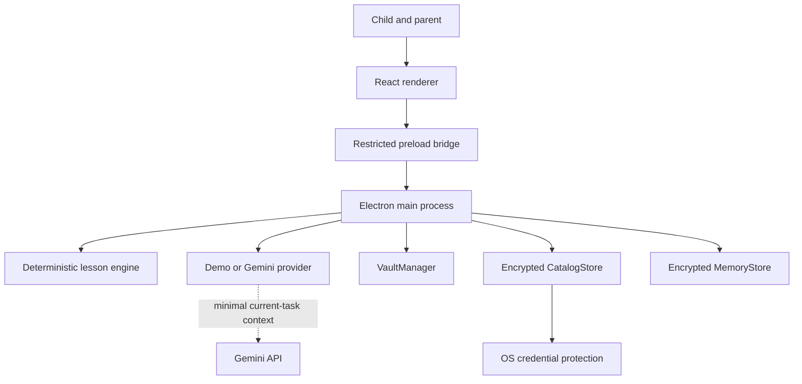
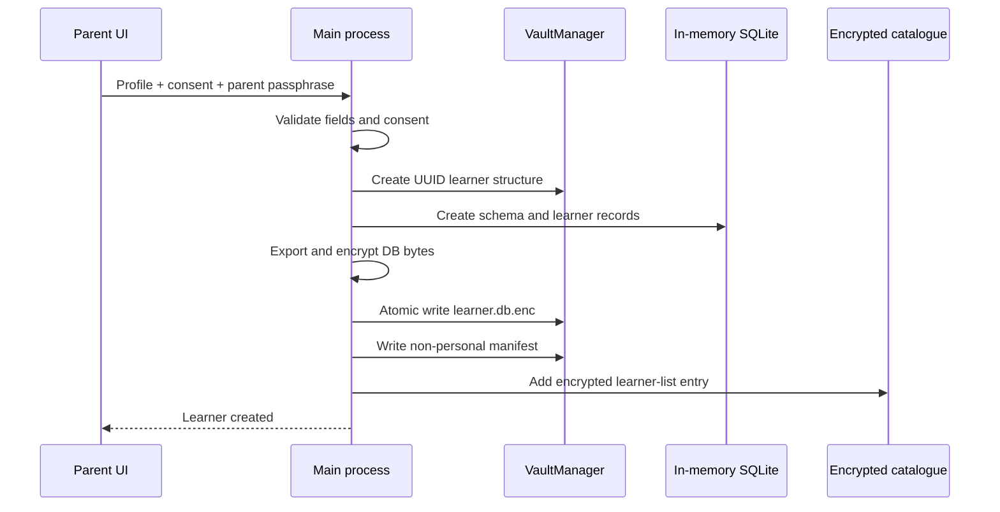

# Architecture

MindCarry is currently a desktop-first, local-memory prototype. The Electron main process owns every privileged operation. The React renderer is treated as untrusted presentation code and receives only a narrow capability API through the preload bridge.

## System overview

## Trust boundaries

### Renderer

Responsibilities:

- child and parent interface;
- typed lesson interaction;
- browser/OS speech recognition;
- optional camera frame processing;
- rendering local progress returned by the main process.

Restrictions:

- no Node.js integration;
- no direct filesystem access;
- no direct Electron APIs;
- no direct access to API keys;
- no direct learner-database access;
- no arbitrary IPC channel selection.

### Preload bridge

`electron/preload.cjs` exposes named methods only:

- application status and vault-folder opening;
- Gemini key management;
- learner create/list/unlock/lock/export/import;
- lesson start/answer/cancel.

It does not expose `ipcRenderer`, filesystem, shell or arbitrary channel access.

### Electron main process

Responsibilities:

- IPC sender validation;
- input validation;
- media permission policy;
- vault creation;
- encryption and decryption;
- learner-database lifecycle;
- device catalogue protection;
- model credential handling;
- Gemini requests;
- import/export dialogs;
- session state.

The main process is the only process allowed to write learner files or obtain the Gemini API key.

### Learner Memory

Each learner database is created as SQLite in memory, exported to bytes and encrypted before disk persistence. It contains:

- profile and consent;
- skills and mastery;
- lesson sessions;
- attempts and misconceptions;
- structured memories;
- optional consented engagement events.

The decrypted database exists only in the Electron main-process memory while unlocked.

### Encrypted device catalogue

The home screen requires learner names before a parent unlocks a database. Those names are stored in `learner-catalog.enc`, not in plaintext manifests.

The catalogue uses a random 256-bit device key. Electron `safeStorage` protects the key with the operating system’s credential protection.

This catalogue is device-specific and never exported.

### AI provider

The provider abstraction currently supports:

- deterministic local demo explanations;
- Gemini-generated short alternative explanations.

The AI provider does not own lesson state, mastery logic or persistent memory. Model output is returned to the orchestrator and is never allowed to execute code or write directly to the database.

## Startup sequence

1. Electron reaches `app.whenReady()`.
2. `VaultManager` creates the complete runtime structure.
3. A device catalogue key is loaded or generated through `safeStorage`.
4. `CatalogStore` opens the encrypted learner list.
5. `MemoryStore` loads SQL.js and performs legacy-manifest migration.
6. The secure BrowserWindow is created.
7. media permission handlers and IPC handlers are registered.
8. the renderer requests status and the encrypted learner list.

## Learner creation sequence

Any failure removes the incomplete learner structure.

## Lesson orchestration

The current lesson is a deterministic three-stage vertical slice:

1. concrete addition question;
2. pictorial recheck;
3. independent transfer question.

The main process:

- timestamps the question;
- parses and assesses the answer;
- identifies a simple misconception;
- selects an intervention;
- optionally asks Gemini for child-safe wording;
- falls back to deterministic wording on model failure;
- records the attempt;
- updates mastery only after transfer evidence;
- writes structured memories at session completion.

## Data persistence

A learner remains unlocked in the main process during the active parent/child session. Every material database update exports and encrypts the current database, rotates an encrypted backup and atomically replaces the main encrypted file.

A future optimisation may batch writes, but correctness and crash resilience are prioritised in the pre-MVP.

## Media boundary

Camera frames remain inside the renderer. The current experiment computes a numeric movement value and sends only that number with a lesson answer when both camera and local-behaviour-analysis consent are enabled.

The main process grants media permission only during the active learner lesson and only for consented media types.

## Portability

A `.childmind` package contains:

- package format/version;
- non-personal technical manifest;
- already-encrypted learner database;
- integrity checksum.

The receiving installation:

1. validates size, format, version, UUID and checksum;
2. creates the learner folder automatically;
3. copies the encrypted database atomically;
4. lists it as **Imported learner**;
5. asks for the original parent passphrase;
6. verifies database integrity and learner identity;
7. updates the receiving device’s encrypted catalogue with the real profile.

## Vercel boundary

Vercel is not part of the current runtime architecture. It may later host a public website or waitlist. The learner database must remain outside that website unless the product undergoes an explicit cloud-privacy redesign.
